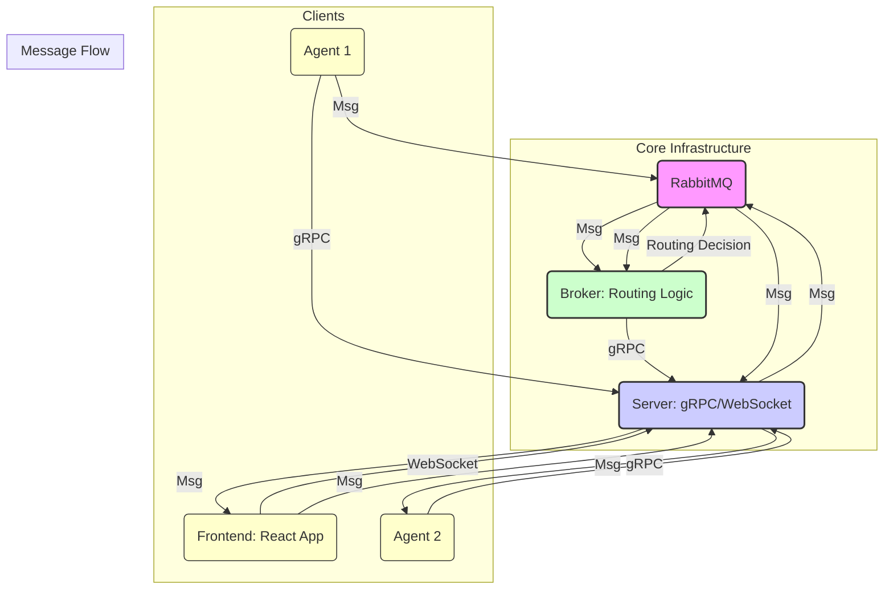

# Community - Agent Communication System

This project provides a distributed communication infrastructure enabling interactions between AI agents, humans (via a web frontend), and various backend services.

## Architecture Overview

The system is composed of several microservices communicating via gRPC and RabbitMQ:

*   **[RabbitMQ](https://www.rabbitmq.com/)**: Message broker for asynchronous communication.
*   **[Server](./server/README.md)**: Central hub managing agent/broker registration (gRPC), frontend connections (WebSocket), and message routing coordination.
*   **[Broker](./broker/README.md)**: Routes messages between agents and the server based on agent status.
*   **[Agent](./agent/README.md)**: Individual service instances, potentially connected to LLMs or other tools. Communicate via gRPC and RabbitMQ.
*   **[Frontend](./frontend/README.md)**: Web application (React) for human interaction via WebSockets.
*   **[Shared Models](./shared_models/README.md)**: Common Python data structures (Pydantic models) used by backend services.
*   **Shared Protos (`shared/protos/`)**: Protocol Buffer definitions for gRPC communication.

## Getting Started

For instructions on setting up prerequisites (Docker, Python, Poetry) and running the core infrastructure, please refer to the **[Getting Started Guide](./GETTING_STARTED.md)**.

To run individual services (Agent, Broker, Server, Frontend), consult their respective README files linked above.

## Project Structure

-   `agent/`: Agent service implementation.
-   `broker/`: Broker service implementation.
-   `server/`: Server service implementation.
-   `frontend/`: Frontend web application.
-   `shared_models/`: Shared Python Pydantic models.
-   `shared/protos/`: Shared Protocol Buffer definitions.
-   `docs/`: Additional documentation (API, Agent Development).
-   `GETTING_STARTED.md`: Initial setup guide.
-   `docker-compose.yml`: Docker Compose configuration for infrastructure.

## Contributing

Please see [CONTRIBUTING.md](CONTRIBUTING.md) for details.

