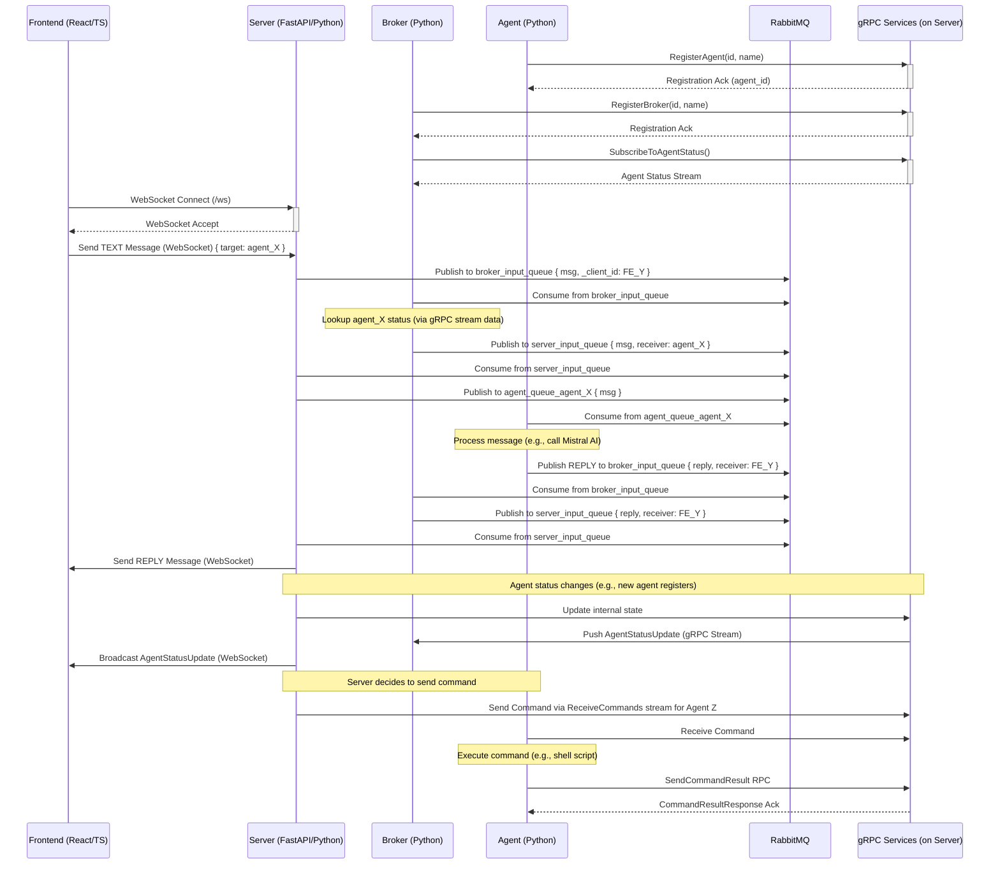

# Community - Agent Communication System

This project provides a communication infrastructure for agents to interact with each other and with humans.

## Architecture

The system consists of:

- **RabbitMQ** message broker for agent-to-agent and agent-to-system communication
- **Server** providing WebSocket and gRPC services
- **Broker** for message routing between different parts of the system
- **Agents** that can be connected to various LLMs and tools
- **Frontend** web application for human interaction

Docker and Docker Compose V2 are used for the core infrastructure. For installation instructions, see [GETTING_STARTED.md](GETTING_STARTED.md).

## Requirements

- Python 3.13.2+ (for running agents)
- Docker and Docker Compose V2 (for infrastructure)

## Running the System

Start the core infrastructure:

```bash
docker compose up --build
```

Run an agent:

```bash
cd agent
poetry install
poetry run python src/agent.py --name "MyAgent"
```

To stop all services:

```bash
docker compose down
```

## Documentation

- [Getting Started Guide](GETTING_STARTED.md) - Instructions for setting up the system
- [API Documentation](docs/api.md) - API reference
- [Agent Development](docs/agents.md) - Guide to developing new agents

## Contributing

Please see [CONTRIBUTING.md](CONTRIBUTING.md) for details on how to contribute to this project.

## License

This project is licensed under the MIT License - see the [LICENSE](LICENSE) file for details.

## Components

-   **Server (`/server`):** Python/FastAPI application.
    -   Manages WebSocket connections with the Frontend (`websocket_handler.py`).
    -   Provides gRPC services for Agent/Broker registration and status (`agent_registration_service.py`, `agent_status_service.py`, `broker_registration_service.py`).
    -   Orchestrates message flow via RabbitMQ (`rabbitmq_utils.py`, `services.py`).
    -   [See Server README](./server/README.md)
-   **Broker (`/broker`):** Python application.
    -   Connects to the Server via gRPC to register itself and subscribe to agent status updates (`grpc_client.py`).
    -   Consumes messages from RabbitMQ (`broker_input_queue`).
    -   Routes messages to the appropriate agent or back to the server via RabbitMQ (`broker.py`).
    -   [See Broker README](./broker/README.md)
-   **Agent (`/agent`):** Python application.
    -   Connects to the Server via gRPC for registration and potentially receiving commands (`grpc_client.py`).
    -   Connects to RabbitMQ to consume messages from its dedicated queue (`agent.py`).
    -   Processes messages (e.g., using Mistral AI client) and publishes replies to RabbitMQ (`agent.py`).
    -   Includes an example agent (`example_agent.py`) focused on executing commands received via gRPC.
    -   [See Agent README](./agent/README.md)
-   **Frontend (`/frontend`):** Web application built with React, TypeScript, and Vite.
    -   Connects to the Server via WebSockets for real-time chat and agent status updates.
    -   Provides the user interface for interaction.
    -   [See Frontend README](./frontend/README.md)
-   **Shared Models (`/shared_models`):** Python library using Pydantic for common data structures (Messages, Enums, Status) used by Server, Broker, and Agent. [See Shared Models README](./shared_models/README.md)
-   **Protobuf Definitions (`/server/src/protos`, `/broker/src/protos`, `/agent/protos`):** `.proto` files defining the gRPC services and message structures used for Server/Broker/Agent communication.

## System Operation

1.  **Agent/Broker Registration (gRPC):** Agents and Brokers start and register with the Server via gRPC (`RegisterAgent`, `RegisterBroker`).
2.  **Frontend Connection (WebSocket):** The React/TypeScript frontend establishes a WebSocket connection with the FastAPI Server.
3.  **Status Subscription (gRPC):** The Broker subscribes to agent status updates from the Server via a gRPC stream (`SubscribeToAgentStatus`). The Server broadcasts status changes to connected Frontends (WebSocket) and Brokers (gRPC).
4.  **Message Sending (Frontend -> Server - WebSocket):** A user sends a message via the Frontend. It travels over WebSocket to the Server.
5.  **Message Queuing (Server -> Broker - RabbitMQ):** The Server publishes the message to the `broker_input_queue` in RabbitMQ.
6.  **Message Routing (Broker -> Server - RabbitMQ):** The Broker consumes the message, uses its agent registry (updated via gRPC) to determine the target agent, and publishes the message to the `server_input_queue` with the target agent's ID.
7.  **Message Delivery (Server -> Agent - RabbitMQ):** The Server consumes the message from `server_input_queue` and publishes it to the specific agent's queue (`agent_queue_<agent_id>`).
8.  **Agent Processing (Agent):** The Agent consumes the message from its RabbitMQ queue, processes it (e.g., using Mistral AI), and formulates a response.
9.  **Response Queuing (Agent -> Broker - RabbitMQ):** The Agent publishes the response message back to the `broker_input_queue`.
10. **Response Routing (Broker -> Server - RabbitMQ):** The Broker consumes the response, sees the target is the original frontend client, and publishes it to the `server_input_queue`.
11. **Response Delivery (Server -> Frontend - WebSocket):** The Server consumes the response from `server_input_queue` and sends it to the correct Frontend client via WebSocket.
12. **Command Handling (Server <-> Agent - gRPC - Optional):** The Server can send commands (defined in `.proto`) to Agents via a gRPC stream (`ReceiveCommands`). Agents execute commands and send results back via gRPC (`SendCommandResult`). (See `example_agent.py`).

## Architecture Diagram



## Prerequisites

-   Docker & Docker Compose V2 for core infrastructure
    -   For installation instructions, see [GETTING_STARTED.md](./GETTING_STARTED.md#installing-docker-and-docker-compose)
-   Python 3.13.2+ & Poetry for running agents
-   Environment variables set as required for agents (e.g., `MISTRAL_API_KEY`)

## Running the System

### Option 1: Docker Compose V2 (Recommended)

The system includes Docker Compose configuration in compose.yaml for easy setup of the core infrastructure (RabbitMQ, Server, Broker, and Frontend).

1. **Start core infrastructure:**
```bash
# Build and start all core services
docker compose up --build

# Access the frontend at: http://localhost:5173
# Access RabbitMQ Management UI at: http://localhost:15673 (guest/guest)
```

2. **Start Agents separately:**

Agents are run separately to allow for dynamic addition and custom configuration:

```bash
cd agent
source ~/.bashrc
poetry run python src/agent.py --name "AgentName1"

# Optional: Start additional agents in separate terminals
cd agent
source ~/.bashrc
poetry run python src/agent.py --name "AgentName2"
```

### Option 2: Manual Startup (For Development)

Run each component in a separate terminal.

1. **RabbitMQ (using Docker):**
```bash
docker run -it --rm --name rabbitmq -p 5672:5672 -p 15672:15672 rabbitmq:3-management
# Management UI: http://localhost:15672/ (guest/guest)
```

2. **WebSocket Server:**
```bash
cd server
source ~/.bashrc
poetry run python src/main.py
```

3. **Frontend:**
```bash
cd frontend
npm run dev
# Access via http://localhost:5173 (or as indicated by Vite)
```

4. **Message Routing Broker:**
```bash
cd broker
source ~/.bashrc
poetry run python src/broker.py
```

5. **Agent(s):**
```bash
cd agent
source ~/.bashrc
poetry run python src/agent.py --name "AgentName1"
```