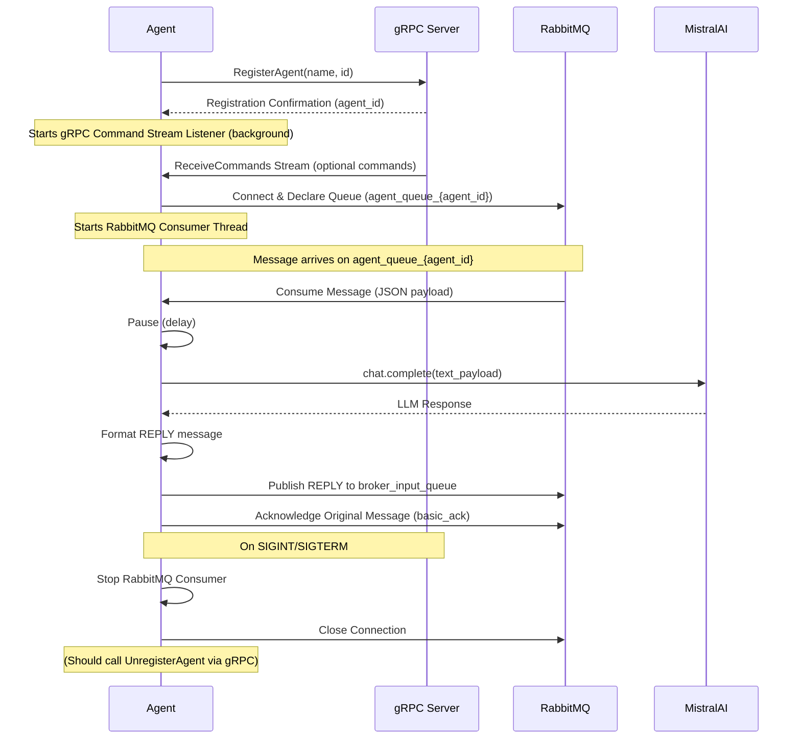

# Agent

This agent connects to a central server via **gRPC** for registration and command handling, and uses RabbitMQ for message processing. When a message arrives on its dedicated RabbitMQ queue, the agent utilizes the Mistral AI API to generate a response and sends it back through the message broker.

## Prerequisites

- Python 3.13 or newer
- RabbitMQ server running
- **gRPC server** (central server component) running
- Poetry for dependency management
- Mistral AI API Key
- Generated gRPC code (run `python generate_grpc.py`)

## Installation

1.  Clone the repository (if you haven't already).
2.  Navigate to the `agent` directory.
3.  **Generate gRPC code:**
    ```bash
    python generate_grpc.py
    ```
4.  Create and activate a virtual environment (recommended):
    ```bash
    python -m venv .venv
    # On Linux/macOS:
    source .venv/bin/activate
    # On Windows:
    .venv\Scripts\activate
    ```
5.  Install dependencies using Poetry:
    ```bash
    poetry install
    ```

## Configuration

Configure the agent using environment variables. Consider using a `.env` file with `python-dotenv` for development.

-   **`MISTRAL_API_KEY` (Required)**: Your Mistral AI API key.
    ```bash
    export MISTRAL_API_KEY='YOUR_MISTRAL_API_KEY'
    ```
-   **`MISTRAL_MODEL` (Optional)**: The Mistral model to use. Defaults to `mistral-small-latest`. See `agent/src/config.py`.
    ```bash
    export MISTRAL_MODEL='mistral-large-latest'
    ```
-   **`GRPC_HOST` (Optional)**: gRPC server host. Defaults to `localhost`.
-   **`GRPC_PORT` (Optional)**: gRPC server port. Defaults to `50051`.
-   **`RABBITMQ_HOST` (Optional)**: RabbitMQ server host. Defaults to `localhost`.

## gRPC Debug Logging

To enable detailed gRPC core debug logs (including keepalive pings/pongs), set the environment variable `GRPC_DEBUG=1` before running the agent. This will activate verbose logging for gRPC internals, including keepalive events, which can be useful for diagnosing connection issues.

Example (Linux/macOS):
```
export GRPC_DEBUG=1
python src/agent.py
```

Example (Windows CMD):
```
set GRPC_DEBUG=1
python src/agent.py
```

This will output gRPC core debug logs to the console, including keepalive pings and pongs.

## Usage

Ensure the required environment variables (especially `MISTRAL_API_KEY`) are set and gRPC code is generated.

Run the agent, providing a unique name:

```bash
# Option 1: Running directly with Poetry (for development)
cd agent
poetry run ./run.sh --name "MyAgent"

```

### Command-line Arguments (`agent.py`)

-   `--name`: (Required) Human-readable name for this agent.
-   `--id`: (Optional) Unique identifier for this agent. Auto-generated if not provided.
-   `--rabbitmq-host`: (Optional) Overrides the `RABBITMQ_HOST` environment variable or default RabbitMQ server host.
-   *(Note: `agent.py` currently uses `GRPC_HOST`/`GRPC_PORT` environment variables for gRPC connection, not command-line args)*

## Command Result Handling

When implementing command callbacks or sending command results to the server, always return a Python dict or a protobuf `CommandResult` object. The agent's gRPC handler (`send_command_result`) will accept either and convert as needed. This prevents type errors and ensures compatibility with gRPC.

Example (recommended):
```python
# In your command callback:
def my_command_handler(command):
    return {
        "success": True,
        "output": "Command completed successfully!",
        "error_message": "",
        "exit_code": 0,
    }
```

You may also return a `CommandResult` directly if you need advanced control:
```python
from generated.agent_registration_service_pb2 import CommandResult

def my_command_handler(command):
    return CommandResult(
        command_id=command["command_id"],
        agent_id="my_agent_id",
        success=True,
        output="Command completed successfully!",
        error_message="",
        exit_code=0,
    )
```

If you return any other type, the agent will log an error and not send the result to the server.

This approach is DRY, robust, and microservice-appropriate. It prevents accidental type errors and makes the contract for command results explicit.

## Information Flow Diagram (`agent.py`)



## Refactored Architecture

The agent now uses two handler classes for separation of concerns:

- `MessageQueueHandler`: Encapsulates all RabbitMQ connection, queue, and message handling logic.
- `ServerManager`: Encapsulates all gRPC/server registration and status update logic.

The `Agent` class orchestrates these handlers and manages high-level agent logic. This structure follows DRY and SOLID principles and is designed for maintainability in a microservices architecture.

## How It Works (`agent.py`)

1.  **Initialization**: The agent starts, parses command-line arguments (`--name`, `--id`, `--rabbitmq-host`), and reads environment variables (`GRPC_HOST`, `GRPC_PORT`, `MISTRAL_API_KEY`, etc.).
2.  **gRPC Registration**: It connects to the specified gRPC server (`GRPC_HOST`:`GRPC_PORT`) and calls the `RegisterAgent` RPC method, sending its name and ID. The server confirms registration. *(See `grpc_client.py`)*.
3.  **RabbitMQ Connection**: It connects to the specified RabbitMQ host (`--rabbitmq-host` or `RABBITMQ_HOST` env var).
4.  **Queue Declaration**: It declares a unique RabbitMQ queue named `agent_queue_{agent_id}`.
5.  **Message Consumption**: It starts listening for messages on its dedicated queue in a separate thread using `pika`.
6.  **Message Processing**: When a message is received from the RabbitMQ queue:
    a.  The agent pauses for a configured delay.
    b.  It sends the message content (`text_payload`) to the configured Mistral AI model via the API.
    c.  It receives the generated text response from Mistral.
    d.  It formats the LLM response into a `REPLY` message.
    e.  It publishes the `REPLY` message to the `broker_input_queue` for the central server/broker to handle via RabbitMQ.
    f.  The original message is acknowledged (`basic_ack`).
7.  **gRPC Command Stream (Implicit)**: Although `agent.py` doesn't explicitly handle commands via gRPC in its main loop, the `grpc_client.py` starts a background task (`command_stream_loop`) upon successful registration. This task listens for commands on the `ReceiveCommands` gRPC stream. If a command callback were set (like in `example_agent.py`), it would process commands here.
8.  **Shutdown**: The agent listens for termination signals (SIGINT, SIGTERM). On receiving a signal:
    a.  It attempts to gracefully close the RabbitMQ connection.
    b.  *(Implicit gRPC Unregistration: While `agent.py`'s signal handler doesn't explicitly call `unregister_agent`, a more robust implementation would do so here. `example_agent.py` demonstrates this.)*
    c.  The main loop and consumer thread stop.

*(Note: `example_agent.py` provides a different example focusing on receiving and executing shell/python commands via the gRPC `ReceiveCommands` stream and sending results back via `SendCommandResult`.)*

## Guaranteed Agent Shutdown

- When the agent receives a 'shutdown' command, it sets a shutdown flag, runs cleanup, and then exits the process using sys.exit(0) from the main event loop.
- This guarantees the agent will not reconnect or restart itself unless managed by an external supervisor.
- The main loop checks the shutdown flag to prevent reconnection attempts after shutdown is triggered.

## Agent Status Updates (DRY, Microservice-Appropriate)

The agent now uses the `SendAgentStatus` RPC (in the AgentStatusService) to send its full state to the server whenever its state changes. All state is reported as key/value pairs in the `metrics` map of the `AgentInfo` message. This is more flexible and future-proof than the previous HeartbeatRequest approach, and avoids redundancy (no separate is_online/status fields).

- On every state change, the agent sends a status update with all current state as metrics.
- The server stores these metrics as a dict keyed by agent_id.
- This mechanism is DRY, simple, and microservice-appropriate.

Example metrics sent:

```json
{
  "internal_state": "idle",
  "grpc_status": "connected",
  "registration_status": "registered",
  "message_queue_status": "connected",
  ...
}
```

See the proto definition for details on the `SendAgentStatus` RPC and the `metrics` map.

## Command Handling

Commands from the server (e.g., pause, resume, status) are received via a gRPC stream. The agent handles these commands using the `_handle_server_command` instance method. This method is registered as a callback with the `grpc_client` module during agent initialization, ensuring proper encapsulation and avoiding global state.

## Agent State Management

A simple `AgentState` class is used to track the agent's connection and registration status. This class records:

- RabbitMQ connection status (`rabbitmq_status`): 'connected' or 'not_connected'
- gRPC connection status (`grpc_status`): 'connected' or 'not_connected'
- Registration status (`registration_status`): 'registered' or 'not_registered'
- Internal state (`internal_state`): 'idle', 'working', or 'paused'

This class is used as a stub for future agent state management and will replace previous ad-hoc state tracking.

## LLMClient Abstraction

The agent uses a generic `LLMClient` class for all LLM interactions. This abstraction allows easy switching between different LLM providers and keeps the agent code simple and maintainable. Currently, it handles the specific implementation details for interacting with the Mistral AI API.

## Message Handling

The agent now delegates message handling to the messaging module for DRY and SOLID compliance. The `handle_message` method in `agent.py` calls `process_message_dict` from `messaging.py`, which encapsulates the message processing and response logic. This ensures a single source of truth for message handling and makes the codebase easier to maintain.

## Exception Handling Simplification

Redundant try/except blocks have been removed from agent modules in favor of the `@log_exceptions` decorator. This decorator now handles all exception logging and propagation for decorated methods, reducing boilerplate and improving maintainability. Only business-logic-specific error handling remains where required.

## Customization

-   Modify the `generate_response` method in `agent/src/agent.py` to change the core LLM interaction logic.
-   Adjust API key, model, and connection details via environment variables or command-line arguments as described in the Configuration and Usage sections.
-   See `agent/src/config.py` for default values and environment variable names.
-   Implement command handling by setting a callback using `grpc_client.set_command_callback(your_handler_function)` (see `example_agent.py`).

## Shutdown

The agent attempts a graceful shutdown upon receiving:
-   A SIGINT or SIGTERM signal (e.g., pressing `Ctrl+C`).
-   *(gRPC Shutdown Command: The gRPC `Command` message definition includes `is_cancellation`, suggesting the server could potentially send a specific shutdown command via the `ReceiveCommands` stream, although this is not explicitly handled in `agent.py`.)*

During shutdown, connections (RabbitMQ, potentially gRPC) should be closed gracefully. Explicitly calling `grpc_client.unregister_agent` is recommended for clean server-side state management.
