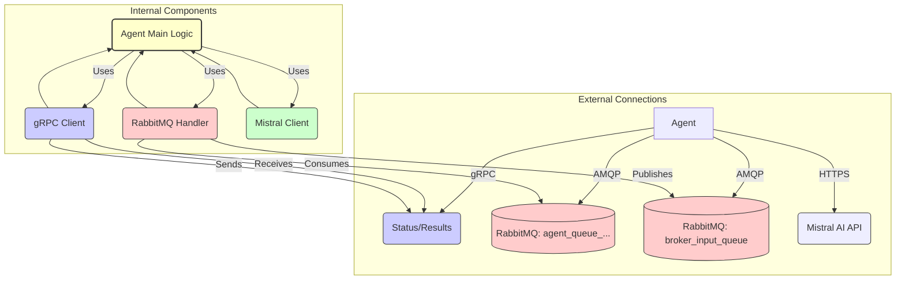

# Agent Service

This service represents an individual agent within the communication system. It connects to the central Server via gRPC for registration and command handling, consumes messages from its dedicated RabbitMQ queue, processes them (potentially using external APIs like Mistral AI), and sends replies back through the system.

For overall system architecture and setup, see the main [Project README](../../README.md) and the [Getting Started Guide](../../GETTING_STARTED.md).

## Core Responsibilities

*   **Registration (gRPC):** Connects to the Server and registers itself using `AgentRegistrationService`.
*   **Status Updates (gRPC):** Sends status updates (including metrics) to the Server using `AgentStatusService` (`SendAgentStatus`).
*   **Command Handling (gRPC):** Optionally listens for commands from the Server via a gRPC stream (`ReceiveCommands`) and sends results back (`SendCommandResult`).
*   **Message Consumption (RabbitMQ):** Listens for messages on its dedicated queue (`agent_queue_<agent_id>`).
*   **Message Processing:** Handles received messages. This example uses the Mistral AI API to generate responses.
*   **Response Publishing (RabbitMQ):** Sends replies back to the `broker_input_queue` for routing.

## Architecture & Message Flow



*Diagram: Agent internal components and interactions.*

1.  **Startup:** Connects to Server via gRPC, registers (`RegisterAgent`).
2.  **Message Consumption:** Listens on `agent_queue_<agent_id>`.
3.  **Processing:** On message receipt, calls Mistral AI API (via `MistralClient`).
4.  **Response:** Publishes reply to `broker_input_queue`.
5.  **Status:** Periodically or on change, sends status/metrics via `SendAgentStatus` gRPC.
6.  **Commands (Optional):** Receives commands via gRPC stream, executes, sends result via `SendCommandResult`.

## Project Structure (`src/`)

*   `agent.py`: Main application logic, `Agent` class, entry point.
*   `config.py`: Environment variable configuration.
*   `grpc_client.py`: Handles gRPC connection and communication with the Server.
*   `message_queue_handler.py`: RabbitMQ interaction utilities.
*   `mistral_client.py`: Client for interacting with the Mistral AI API.
*   `protos/`: Copied Protobuf definitions.
*   `generated/`: Generated gRPC code.

## Prerequisites

-   Python 3.13+
-   Poetry
-   Docker
-   Running RabbitMQ instance
-   Running Server instance (for gRPC)
-   Mistral AI API Key (for this example implementation)
-   Generated gRPC code (`python generate_grpc.py`)

## Installation & Running

### Local Development

1.  **Environment Setup:** Ensure Python, Poetry, and Docker are installed (see [Getting Started Guide](../../GETTING_STARTED.md)).
2.  **Clone Repository:** If not already done.
3.  **Navigate to project root:**
    ```bash
    cd community
    ```
4.  **Generate gRPC Code:**
    ```bash
    cd agent
    python generate_grpc.py
    cd ..
    ```
5.  **Install Dependencies:**
    ```bash
    poetry install
    ```

### Docker

1.  **Build Docker Image:**
    ```bash
    docker build -t agent . -f agent/Dockerfile
    ```
2.  **Run Container:**
    ```bash
    docker run --network community_default --env-file ./agent/.env agent
    ```
6.  **Configure:** Set required environment variables (see `src/config.py`). Create a `.env` file or export them.
    *   `MISTRAL_API_KEY` (Required)
    *   `GRPC_HOST` (Defaults to `localhost`)
    *   `GRPC_PORT` (Defaults to `50051`)
    *   `RABBITMQ_HOST` (Defaults to `localhost`)
    *   `AGENT_NAME` (Optional, used for registration if `--name` argument not provided)
    *   *(Others like `MISTRAL_MODEL`)*
7.  **Run:** Provide a unique name for the agent instance.
    ```bash
    poetry run python agent/src/agent.py --name "MyMistralAgent"
    # Or if AGENT_NAME is set in .env
    # poetry run python agent/src/agent.py
    ```

## Running with Docker

The Agent Dockerfile expects the build context to be the project root (`community/`).

**Build the Agent image:**
```bash
docker build -f agent/Dockerfile -t agent-service .
```

**Run the Agent container:**
```bash
docker run --env-file ./agent/.env \
  --env-file agent/.env \
  agent-service
```

- The container will use the `run.sh` script as its entrypoint.
- Make sure RabbitMQ and the Server are running and accessible from the container.
- Adjust `--env-file` and other options as needed for your environment.

## Configuration Details

Key environment variables (see `src/config.py` for defaults and all options):

-   `MISTRAL_API_KEY`
-   `MISTRAL_MODEL`
-   `RABBITMQ_HOST`, `RABBITMQ_PORT`, `RABBITMQ_USER`, `RABBITMQ_PASSWORD`
-   `GRPC_HOST`, `GRPC_PORT`
-   `LOG_LEVEL` (e.g., `INFO`, `DEBUG`)
-   `AGENT_NAME`

Use a `.env` file in the `agent` directory for local development.

## gRPC Debug Logging

Set `GRPC_DEBUG=1` environment variable to enable verbose gRPC core logs (useful for debugging keepalives and connections).

## Mock gRPC Server for Testing

A simple mock server is provided for local agent development and testing. It accepts agent registration and status updates, logging all received requests.

**To run the mock server:**
```bash
poetry run python -m mock_server.main --port 50051
```
- The agent can then be pointed at `localhost:50051` (the default) for registration and status updates.
- All requests are logged to the console.
