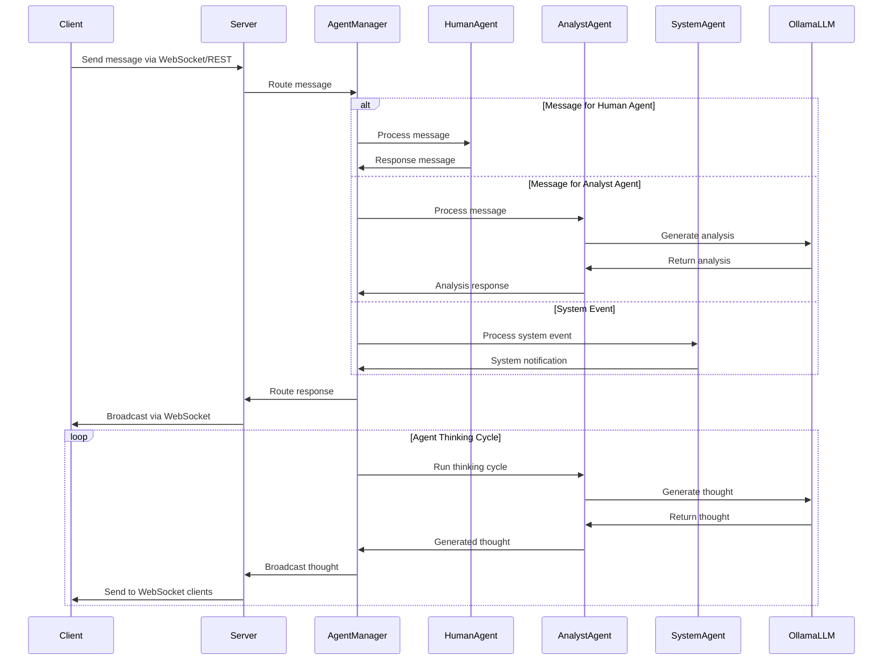

# Agent Community Backend

The backend server for the Agent Community system, providing WebSocket and REST API endpoints for agent communication and monitoring.

## Features

- Real-time agent monitoring via WebSocket
- REST API for agent management and messaging
- Type-safe message passing with Pydantic models
- Structured logging with color support
- Async/await based architecture
- FastAPI for high performance
- Multi-agent communication system with specialized agent types
- Agent Manager for coordinated agent processing
- LLM integration via Ollama

## Project Structure

```
backend/
├── app/
│   ├── api/
│   │   ├── rest.py      # REST API endpoints
│   │   └── websocket.py # WebSocket endpoints
│   ├── core/
│   │   ├── agents/      # Agent implementations
│   │   │   ├── base.py  # Base agent class
│   │   │   ├── analyst.py # Analyst agent implementation
│   │   │   ├── human.py # Human agent implementation
│   │   │   ├── system.py # System agent implementation
│   │   │   └── config.py # Agent configuration
│   │   ├── agent_manager.py # Agent coordination and processing
│   │   ├── models.py    # Data models
│   │   └── server.py    # Agent server implementation
│   ├── utils/
│   │   ├── logger.py    # Logging utilities
│   │   └── ollama.py    # Ollama integration
│   └── main.py          # Application entry point
├── tests/               # Test suite
├── pyproject.toml       # Dependencies and config
└── README.md           # This file
```

## Installation

1. Install Poetry (if not already installed):
```bash
curl -sSL https://install.python-poetry.org | python3 -
```

2. Install dependencies:
```bash
poetry install
```

## Development

1. Start the development server:
```bash
poetry run uvicorn app.main:app --reload --host 0.0.0.0 --port 8000
```

2. Run tests:
```bash
poetry run pytest
```

3. Format code:
```bash
poetry run black app tests
poetry run isort app tests
```

4. Run type checking:
```bash
poetry run mypy app
```

5. Run linting:
```bash
poetry run ruff check app
```

## API Documentation

Once the server is running, visit:
- OpenAPI docs: http://localhost:8000/docs
- ReDoc: http://localhost:8000/redoc

## WebSocket API

Connect to `ws://localhost:8000/ws` for real-time updates.

Message format:
```json
{
  "type": "message",
  "data": {
    "id": "unique-id",
    "timestamp": "2024-02-14T12:00:00Z",
    "sender_id": "agent-id",
    "receiver_id": "recipient-id",
    "content": {
      "text": "message content"
    },
    "message_type": "text"
  }
}
```

## REST API

### Endpoints

- `GET /api/` - Server status
- `GET /api/agents` - List all agents
- `POST /api/messages` - Send a message

Example message POST:
```json
{
  "sender_id": "human",
  "content": {
    "text": "Hello, World!"
  },
  "receiver_id": null,
  "message_type": "text"
}
```

## Agent System Architecture

The system uses an agent-based architecture where different specialized agents can process messages and communicate with each other.



## Environment Variables

Create a `.env` file:
```bash
LOG_LEVEL=INFO
HOST=0.0.0.0
PORT=8000
OLLAMA_BASE_URL=http://localhost:11434
```

## Contributing

1. Fork the repository
2. Create a feature branch
3. Make your changes
4. Run tests and linting
5. Submit a pull request 