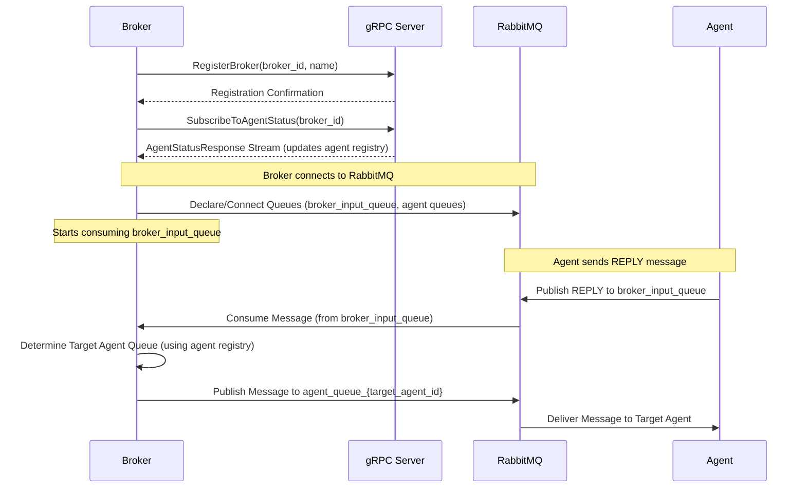

# Broker Service

The broker service acts as a central router for messages within the system. It receives messages intended for agents, determines the appropriate destination agent based on available status information, and forwards the message accordingly via RabbitMQ.

## Architecture Overview

The broker utilizes **gRPC** for communication with the central server and **RabbitMQ** for message queuing and routing.

-   **gRPC Communication:**
    -   **Broker Registration:** Upon startup, the broker registers itself with the central server using the `RegisterBroker` gRPC call, handled by the `ServerManager` class.
    -   **Agent Status Updates:** The broker subscribes to real-time agent status updates from the server using the `SubscribeToAgentStatus` gRPC stream. These updates are processed by the `BrokerState` to keep the broker's internal agent state current. All gRPC logic is encapsulated in `src/server_manager.py` for maintainability and DRY/SOLID compliance.
-   **RabbitMQ Message Flow:**
    -   The broker consumes messages from the `broker_input_queue`. These are typically replies from agents or messages needing routing.
    -   Based on the message details and the agent state maintained by `BrokerState`, the broker determines the target agent.
    -   The broker publishes the message to the `server_input_queue` with the appropriate `receiver_id` set for the server to handle final delivery.

## Broker Service

The broker service is responsible for routing messages between agents and the server, maintaining agent state, and integrating with gRPC and RabbitMQ. It is now implemented as a `Broker` class in `src/broker.py`.

### Key Features
- Encapsulates all broker logic and state in a single class (`Broker`).
- Handles message routing, agent state updates, and gRPC integration.
- Entry point instantiates and runs the `Broker` class for maintainability and testability.

### Usage

To run the broker service:

```bash
python src/broker.py
```

### Code Structure
- All global state and functions are now methods or attributes of the `Broker` class.
- The main execution flow is handled by `Broker.run()`.

### Design Notes
- Follows DRY and SOLID principles for microservices.
- Avoids unnecessary complexity and repetition.
- Message queue handler and state manager are injected as class attributes.

---

For more details, see the code and comments in `src/broker.py`.

## Prerequisites

-   Python (version specified in `pyproject.toml`)
-   RabbitMQ server running
-   gRPC server (central server component) running
-   Poetry for dependency management
-   Generated gRPC code (run `python generate_grpc.py`)

## Installation

1.  Clone the repository (if you haven't already).
2.  Navigate to the `broker` directory.
3.  **Generate gRPC code:**
    ```bash
    python generate_grpc.py
    ```
    *(This copies necessary `.proto` files from the server and generates Python gRPC code)*
4.  Create and activate a virtual environment (recommended):
    ```bash
    python -m venv .venv
    # On Linux/macOS:
    source .venv/bin/activate
    # On Windows:
    .venv\Scripts\activate
    ```
5.  Install dependencies using Poetry:
    ```bash
    poetry install
    ```

## Configuration

Configure the broker using environment variables.

-   **`GRPC_HOST` (Required)**: gRPC server host.
-   **`GRPC_PORT` (Required)**: gRPC server port (e.g., `50051`).
-   **`RABBITMQ_HOST` (Required)**: RabbitMQ server host.
-   **`BROKER_ID` (Optional)**: Unique ID for this broker instance. Auto-generated if not provided.
-   **`BROKER_NAME` (Optional)**: Human-readable name for this broker. Defaults to `Broker-{hostname}` if not provided.

Example:
```bash
export GRPC_HOST='localhost'
export GRPC_PORT='50051'
export RABBITMQ_HOST='localhost'
export BROKER_NAME='PrimaryBroker'
```

## Usage

Ensure the required environment variables are set and gRPC code is generated.

Start the broker service:
```bash
# Option 1: Running directly with Poetry (for development)
poetry run python src/broker.py

# Option 2: Using Docker Compose
docker compose up broker

# Option 3: Using Docker directly
docker build -f broker/Dockerfile -t community_broker .
docker run -p 50051:50051 community_broker
```

## Running with Docker

When running with Docker, you can pass environment variables using the `-e` flag:

```bash
docker run -p 50051:50051 \
  -e GRPC_HOST=host.docker.internal \
  -e GRPC_PORT=50051 \
  -e RABBITMQ_HOST=host.docker.internal \
  -e BROKER_NAME=DockerBroker \
  community_broker
```

Note: When using Docker, you may need to use `host.docker.internal` instead of `localhost` to connect to services running on the host machine, or ensure proper Docker networking is set up between containers.

## Information Flow Diagram



## Components

-   **`broker.py`**: Main application entry point. Handles initialization, instantiates the `BrokerState`, starts the gRPC client (via `ServerManager`), sets up RabbitMQ connections, and manages the main application lifecycle and message routing logic.
-   **`server_manager.py`**: Handles all gRPC communication for the broker, including registration and agent status updates. This is now the single source of truth for all gRPC logic in the broker, following DRY and SOLID principles.
-   **`state.py`**: Contains the `BrokerState` class, responsible for managing the in-memory state of known agents (online status, names, etc.) based on updates received via gRPC. Provides thread-safe methods to query agent state.
-   **`message_queue_handler.py`**: Manages RabbitMQ connections, consuming messages from `broker_input_queue`, and publishing messages to specific agent queues.
-   **`generated/`**: Directory containing Python code generated from `.proto` files.
-   **`src/protos/`**: Copied `.proto` definitions from the server.

## Message Queue Handling (2025 Update)

The broker now uses a dedicated `MessageQueueHandler` class (see `src/message_queue_handler.py`) for all RabbitMQ operations. This handler:
- Encapsulates connection, queue declaration, message consumption, and publishing logic.
- Is instantiated in `broker.py` and used for both consuming from `broker_input_queue` and publishing to `server_input_queue`.
- Follows the same DRY, SOLID, and microservice-friendly approach as the agent's message queue handler.

**Benefits:**
- Consistent, maintainable message queue logic across microservices.
- No direct `pika` usage or ad-hoc consumer setup in `broker.py`.
- Easier to test, extend, and debug.

**If you previously used direct RabbitMQ code in `broker.py`, update your integrations to use the `MessageQueueHandler` interface.**

## Async Message Handler Support (2025 Update)

The `MessageQueueHandler` now supports async (coroutine) message handlers. If you pass an async function as the message handler, it will be scheduled on the main event loop using `asyncio.run_coroutine_threadsafe`. This is required for correct integration with async broker logic (such as `Broker.handle_incoming_message`).

**Usage Example:**

```python
# In broker.py
self.mq_handler = MessageQueueHandler(
    state_update=..., 
    message_handler=self.handle_incoming_message,  # can be async
    event_loop=asyncio.get_event_loop()
)
```

This prevents coroutine warnings and ensures async message processing works as expected in threaded consumers.

## Design Notes (2025 Update)

- All gRPC logic is now handled in `src/server_manager.py`. The old `grpc_client.py` is no longer used and can be deleted.
- This change improves maintainability, reduces repetition, and follows microservices best practices (DRY/SOLID).
- The codebase is now simpler and easier to extend or debug.

## Shutdown

The broker attempts a graceful shutdown upon receiving SIGINT or SIGTERM signals, closing RabbitMQ and gRPC connections.