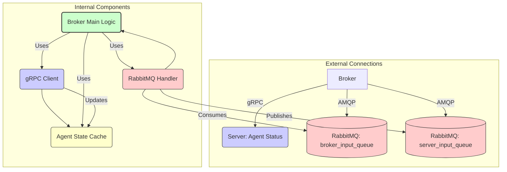

# Broker Service

This service acts as a message router within the Agent Communication System. It receives messages destined for agents, determines the appropriate target based on agent status information obtained from the Server, and forwards the message via RabbitMQ.

For overall system architecture and setup, see the main [Project README](../../README.md) and the [Getting Started Guide](../../GETTING_STARTED.md).

## Core Responsibilities

*   **gRPC Communication:** Connects to the central Server via gRPC to register itself and subscribe to real-time agent status updates (`SubscribeToAgentStatus`).
*   **State Management:** Maintains an internal representation of agent availability based on status updates received from the Server.
*   **Message Routing (RabbitMQ):**
    *   Consumes messages from `broker_input_queue` (sent by Server or Agents).
    *   Determines the target agent based on message details and internal state.
    *   Publishes the message to `server_input_queue` with the `receiver_id` set for the Server to handle final delivery to the agent or frontend.

## Architecture & Message Flow



*Diagram: Broker internal components and interactions.*

1.  **Startup:** Connects to Server via gRPC, registers, and subscribes to agent status updates.
2.  **Status Updates:** Receives agent status via gRPC stream and updates internal `BrokerState`.
3.  **Message Consumption:** Reads messages from `broker_input_queue`.
4.  **Routing Decision:** Uses `BrokerState` and message metadata to determine the target agent (if applicable).
5.  **Message Publishing:** Publishes the message (with `receiver_id`) to `server_input_queue` for the Server to handle.

## Project Structure (`src/`)

*   `broker.py`: Main application logic, `Broker` class, entry point.
*   `config.py`: Environment variable configuration.
*   `grpc_client.py`: Handles gRPC connection and communication with the Server.
*   `message_queue_handler.py`: RabbitMQ interaction utilities.
*   `state.py`: Manages the broker's internal agent state cache (`BrokerState`).
*   `protos/`: Copied Protobuf definitions.
*   `generated/`: Generated gRPC code.

## Prerequisites

-   Python 3.13+
-   Poetry
-   Running RabbitMQ instance
-   Running Server instance (for gRPC)
-   Generated gRPC code (`python generate_grpc.py`)

## Installation & Running

1.  **Environment Setup:** Ensure Python, Poetry, and Docker are installed (see [Getting Started Guide](../../GETTING_STARTED.md)).
2.  **Clone Repository:** If not already done.
3.  **Navigate to `broker` directory.**
4.  **Generate gRPC Code:**
    ```bash
    python generate_grpc.py
    ```
5.  **Install Dependencies:**
    ```bash
    poetry install
    ```
6.  **Configure:** Set required environment variables (see `src/config.py`). Create a `.env` file or export them.
    *   `RABBITMQ_HOST` (Defaults to `localhost`)
    *   `GRPC_HOST` (Required, no default)
    *   `GRPC_PORT` (Defaults to `50051`)
    *   *(Others as needed)*
7.  **Run:**
    ```bash
    poetry run python src/broker.py
    ```

## Configuration Details

Key environment variables (see `src/config.py` for defaults and all options):

-   `RABBITMQ_HOST`, `RABBITMQ_PORT`, `RABBITMQ_USER`, `RABBITMQ_PASSWORD`
-   `GRPC_HOST`, `GRPC_PORT`
-   `LOG_LEVEL` (e.g., `INFO`, `DEBUG`)

Use a `.env` file in the `broker` directory for local development.