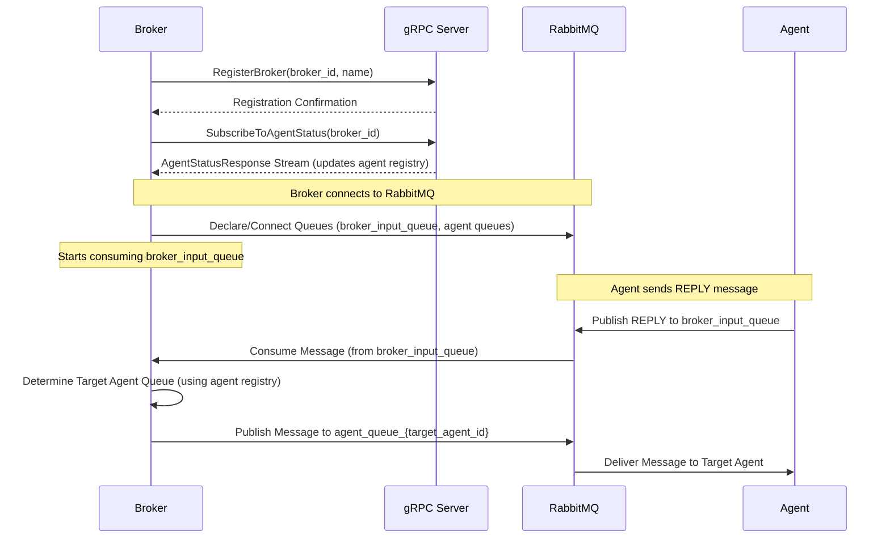

# Broker Service

The broker service acts as a central router for messages within the system. It receives messages intended for agents, determines the appropriate destination agent based on available status information, and forwards the message accordingly via RabbitMQ.

## Architecture Overview

The broker utilizes **gRPC** for communication with the central server and **RabbitMQ** for message queuing and routing.

-   **gRPC Communication:**
    -   **Broker Registration:** Upon startup, the broker registers itself with the central server using the `RegisterBroker` gRPC call.
    -   **Agent Status Updates:** The broker subscribes to real-time agent status updates from the server using the `SubscribeToAgentStatus` gRPC stream. This keeps the broker's internal agent registry up-to-date.
-   **RabbitMQ Message Flow:**
    -   The broker consumes messages from the `broker_input_queue`. These are typically replies from agents or messages needing routing.
    -   Based on the message details and its internal agent registry, the broker determines the target agent's queue (`agent_queue_{agent_id}`).
    -   The broker publishes the message directly to the target agent's queue.

## Prerequisites

-   Python (version specified in `pyproject.toml`)
-   RabbitMQ server running
-   gRPC server (central server component) running
-   Poetry for dependency management
-   Generated gRPC code (run `python generate_grpc.py`)

## Installation

1.  Clone the repository (if you haven't already).
2.  Navigate to the `broker` directory.
3.  **Generate gRPC code:**
    ```bash
    python generate_grpc.py
    ```
    *(This copies necessary `.proto` files from the server and generates Python gRPC code)*
4.  Create and activate a virtual environment (recommended):
    ```bash
    python -m venv .venv
    # On Linux/macOS:
    source .venv/bin/activate
    # On Windows:
    .venv\Scripts\activate
    ```
5.  Install dependencies using Poetry:
    ```bash
    poetry install
    ```

## Configuration

Configure the broker using environment variables.

-   **`GRPC_HOST` (Required)**: gRPC server host.
-   **`GRPC_PORT` (Required)**: gRPC server port (e.g., `50051`).
-   **`RABBITMQ_HOST` (Required)**: RabbitMQ server host.
-   **`BROKER_ID` (Optional)**: Unique ID for this broker instance. Auto-generated if not provided.
-   **`BROKER_NAME` (Optional)**: Human-readable name for this broker. Defaults to `Broker-{hostname}` if not provided.

Example:
```bash
export GRPC_HOST='localhost'
export GRPC_PORT='50051'
export RABBITMQ_HOST='localhost'
export BROKER_NAME='PrimaryBroker'
```

## Usage

Ensure the required environment variables are set and gRPC code is generated.

Start the broker service:
```bash
poetry run python src/broker.py
```

## Information Flow Diagram



## Components

-   **`broker.py`**: Main application entry point. Handles initialization, starts gRPC client and RabbitMQ consumer.
-   **`grpc_client.py`**: Manages gRPC connections for registration and agent status updates. Handles streaming and reconnection logic.
-   **`rabbitmq_handler.py`**: Manages RabbitMQ connections, consuming messages from `broker_input_queue`, and publishing messages to specific agent queues.
-   **`agent_registry.py`**: In-memory store for agent status information received via gRPC.
-   **`generated/`**: Directory containing Python code generated from `.proto` files.
-   **`src/protos/`**: Copied `.proto` definitions from the server.

## Shutdown

The broker attempts a graceful shutdown upon receiving SIGINT or SIGTERM signals, closing RabbitMQ and gRPC connections.