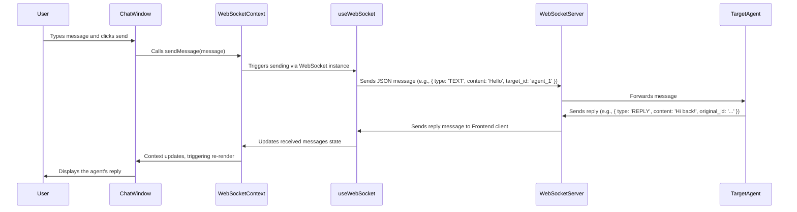

# Frontend

This is the web-based frontend client for the Agent Communication System. It provides a real-time chat interface and displays the status of connected agents.

Built with React, TypeScript, and Vite.

## Features

-   **Real-time Chat:** Connects to the server via WebSocket for sending and receiving chat messages.
-   **Agent Status Panel:** Displays a list of registered agents and their online/offline status, updated in real-time.
-   **WebSocket Management:** Handles WebSocket connection, automatic reconnection attempts, and keepalive (via server heartbeats).
-   **Context-based State Sharing:** Uses React Context (`WebSocketContext`) to share WebSocket connection state and received messages between components.
-   **Agent State Management:** Utilizes Zustand (`agentStore.ts`) for managing the list of agents and their statuses received from the server.
-   **Modern UI:** Simple, clean interface styled using CSS variables and potentially modern CSS features.

## Prerequisites

-   Node.js (v18 or later recommended)
-   npm or yarn
-   A running instance of the backend server component.

## Installation

1.  Navigate to the `frontend` directory.
2.  Install dependencies:
    ```bash
    npm install
    # or
    # yarn install
    ```

## Configuration

The frontend requires the WebSocket URL of the backend server. This is configured via environment variables:

1.  Create a `.env` file in the `frontend` root directory (if it doesn't exist).
2.  Add the following line, replacing the URL with your actual server's WebSocket endpoint:
    ```env
    VITE_WS_URL=ws://localhost:8765/ws
    ```

See `src/config.ts` for how environment variables are loaded.

## Running the Development Server

To start the frontend in development mode with hot reloading:

```bash
npm run dev
# or
# yarn dev
```

This will typically start the server on `http://localhost:5173` (or the next available port).

## Building for Production

To create an optimized production build:

```bash
npm run build
# or
# yarn build
```

The production-ready files will be placed in the `dist` directory. You can serve these files using a static file server (like `serve` or Nginx).

```bash
npm install -g serve
serve -s dist
```

## Core Components

-   **`src/main.tsx`**: Application entry point, renders `App`.
-   **`src/App.tsx`**: Main application component, sets up the `WebSocketProvider` and renders `ChatUI`.
-   **`src/components/ChatUI/ChatUI.tsx`**: Orchestrates the main UI layout, including `AgentPanel` and `ChatWindow`. Manages WebSocket connection state via `useWebSocket` hook.
-   **`src/components/ChatWindow/ChatWindow.tsx`**: Displays chat messages and provides the input area for sending messages. Uses `WebSocketContext`.
-   **`src/components/AgentPanel/AgentPanel.tsx`**: Displays the list of connected agents and their status. Uses `agentStore`.
-   **`src/context/WebSocketContext.tsx`**: React Context provider for WebSocket state (connection status, messages, sendMessage function).
-   **`src/hooks/useWebSocket.ts`**: Custom hook encapsulating WebSocket connection logic (connect, disconnect, message handling, registration, heartbeats, reconnection).
-   **`src/store/agentStore.ts`**: Zustand store for managing the state of connected agents.
-   **`src/config.ts`**: Loads and exports configuration (e.g., WebSocket URL).
-   **`src/types/message.ts`**: Defines shared TypeScript types for WebSocket messages.

## WebSocket Communication

-   Managed primarily by the `useWebSocket` hook, initiated within `App.tsx` via `WebSocketProvider`.
-   Connects to the URL specified by `VITE_WS_URL`.
-   Registers the client as `REGISTER_FRONTEND` upon successful connection.
-   Listens for incoming messages (`AGENT_STATUS_UPDATE`, `TEXT`, `REPLY`, `ERROR`, `SERVER_HEARTBEAT`, etc.).
    -   `AGENT_STATUS_UPDATE` messages trigger updates in the `agentStore`.
    -   Other messages (like `TEXT`, `REPLY`) are stored in the `WebSocketContext` for display by components like `ChatWindow`.
-   Handles `SERVER_HEARTBEAT` messages to confirm the connection is alive.
-   Provides connection status (`isConnected`) and a `sendMessage` function via `WebSocketContext` for components to use.
-   Includes logic for automatic reconnection attempts on disconnection.

## Agent Status Indicator Colors

The agent list now uses color-coded indicator lights for each known `internal_state` value:

- **idle**: green
- **initializing**: orange
- **working**: blue
- **paused**: yellow (with pulse animation)
- **offline**: red
- **unknown/other**: white (with border)

This makes it easy to visually distinguish agent states at a glance. See `src/components/AgentList.tsx` for implementation details.

## Agent Subsystem Status Icons

Each agent row now displays a set of status icons (green check or red cross) for the following subsystems:

- **Messaging queue** (message_queue_status)
- **Server** (grpc_status)
- **AI** (llm_client_status)
- **Registered** (registration_status)

A green check means the subsystem is healthy (e.g., 'connected' or 'registered'), and a red cross means it is not. Hovering over an icon shows a tooltip with the subsystem name and its current status value. This makes it easy to see at a glance which parts of each agent are working.

See `src/components/AgentList.tsx` for implementation details.

## Information Flow (Example: User sends a message)



## Project Structure

```
frontend/
├── public/               # Static assets (e.g., favicons)
├── src/
│   ├── assets/           # Asset files (if any)
│   ├── components/
│   │   ├── AgentPanel/   # Agent status display component
│   │   ├── ChatUI/       # Main UI orchestrator component
│   │   └── ChatWindow/   # Chat message display and input component
│   ├── context/
│   │   └── WebSocketContext.tsx # WebSocket state context
│   ├── hooks/
│   │   └── useWebSocket.ts    # WebSocket management hook
│   ├── store/
│   │   └── agentStore.ts      # Agent state management (Zustand)
│   ├── types/
│   │   └── message.ts         # TypeScript message types
│   ├── App.tsx           # Root React component
│   ├── config.ts         # Configuration loader
│   ├── index.css         # Global styles
│   └── main.tsx          # Application entry point
├── .env.example          # Example environment variables
├── .eslintrc.cjs         # ESLint configuration
├── .gitignore            # Git ignore rules
├── index.html            # Main HTML file
├── package.json          # Project dependencies and scripts
├── README.md             # This file
├── tsconfig.json         # TypeScript configuration
├── tsconfig.node.json    # TypeScript config for Node environment (e.g., Vite config)
└── vite.config.ts        # Vite build tool configuration
```

---

# React + TypeScript + Vite

This template provides a minimal setup to get React working in Vite with HMR and some ESLint rules.

Currently, two official plugins are available:

- [@vitejs/plugin-react](https://github.com/vitejs/vite-plugin-react/blob/main/packages/plugin-react/README.md) uses [Babel](https://babeljs.io/) for Fast Refresh
- [@vitejs/plugin-react-swc](https://github.com/vitejs/vite-plugin-react-swc) uses [SWC](https://swc.rs/) for Fast Refresh

## Expanding the ESLint configuration

If you are developing a production application, we recommend updating the configuration to enable type-aware lint rules:

```js
export default tseslint.config({
  extends: [
    // Remove ...tseslint.configs.recommended and replace with this
    ...tseslint.configs.recommendedTypeChecked,
    // Alternatively, use this for stricter rules
    ...tseslint.configs.strictTypeChecked,
    // Optionally, add this for stylistic rules
    ...tseslint.configs.stylisticTypeChecked,
  ],
  languageOptions: {
    // other options...
    parserOptions: {
      project: ['./tsconfig.node.json', './tsconfig.app.json'],
      tsconfigRootDir: import.meta.dirname,
    },
  },
})
```

You can also install [eslint-plugin-react-x](https://github.com/Rel1cx/eslint-react/tree/main/packages/plugins/eslint-plugin-react-x) and [eslint-plugin-react-dom](https://github.com/Rel1cx/eslint-react/tree/main/packages/plugins/eslint-plugin-react-dom) for React-specific lint rules:

```js
// eslint.config.js
import reactX from 'eslint-plugin-react-x'
import reactDom from 'eslint-plugin-react-dom'

export default tseslint.config({
  plugins: {
    // Add the react-x and react-dom plugins
    'react-x': reactX,
    'react-dom': reactDom,
  },
  rules: {
    // other rules...
    // Enable its recommended typescript rules
    ...reactX.configs['recommended-typescript'].rules,
    ...reactDom.configs.recommended.rules,
  },
})
```
