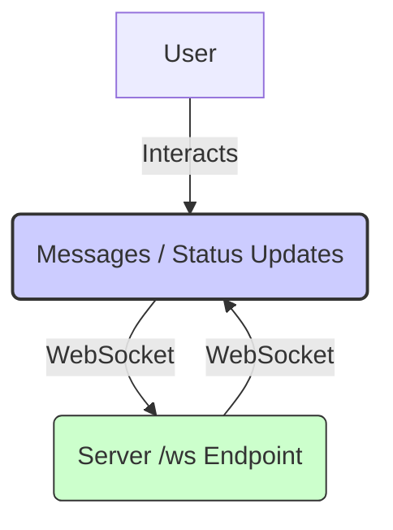

# Frontend Service

This is the web-based frontend client for the Agent Communication System, built with React, TypeScript, and Vite. It provides a real-time chat interface and displays the status of connected agents.

For overall system architecture and setup, see the main [Project README](../../README.md) and the [Getting Started Guide](../../GETTING_STARTED.md).

## Features

*   **Real-time Chat:** Connects to the Server via WebSocket (`/ws`) for sending and receiving messages.
*   **Agent Status:** Displays agent online/offline status, updated in real-time via WebSocket broadcasts from the Server.
*   **WebSocket Management:** Handles connection, reconnection, and keepalive.
*   **State Management:** Uses React Context (`WebSocketContext`) and Zustand (`agentStore.ts`) for managing connection state, messages, and agent statuses.

## Architecture & Interaction



*Diagram: Frontend interaction with the Server via WebSocket.*

1.  The user interacts with the React application in their browser.
2.  The application establishes a WebSocket connection to the Server's `/ws` endpoint.
3.  Chat messages sent by the user are transmitted to the Server over the WebSocket.
4.  The Server pushes incoming messages and agent status updates to the application via the WebSocket.

## Project Structure (`src/`)

*   `main.tsx`: Application entry point.
*   `App.tsx`: Main application component, sets up routing and layout.
*   `components/`: Reusable UI components (e.g., `ChatInterface`, `AgentStatusPanel`).
*   `contexts/`: React Context providers (e.g., `WebSocketProvider`).
*   `hooks/`: Custom React hooks (e.g., `useWebSocket`).
*   `lib/`: Utility functions and types.
*   `store/`: Zustand state management stores (e.g., `agentStore.ts`).
*   `config.ts`: Loads environment variables (like `VITE_WS_URL`).
*   `vite-env.d.ts`: TypeScript definitions for Vite environment variables.

## Prerequisites

-   Node.js (v18+ recommended)
-   npm or yarn
-   A running instance of the Server component.

## Installation & Running

1.  **Environment Setup:** Ensure Node.js, npm/yarn are installed (see [Getting Started Guide](../../GETTING_STARTED.md)).
2.  **Clone Repository:** If not already done.
3.  **Navigate to `frontend` directory.**
4.  **Install Dependencies:**
    ```bash
    npm install
    # or
    # yarn install
    ```
5.  **Configure:** Create a `.env` file in the `frontend` root directory.
    ```env
    # Replace with your server's WebSocket URL
    VITE_WS_URL=ws://localhost:8765/ws
    ```
6.  **Run Development Server:**
    ```bash
    npm run dev
    # or
    # yarn dev
    ```
    Access via the URL provided (usually `http://localhost:5173`).

## Building for Production

```bash
npm run build
# or
# yarn build
```

The output will be in the `dist/` directory. Serve these static files using a web server.

```bash
# Example using 'serve'
npm install -g serve
serve -s dist
```

## Dependency Management

If `package.json` changes, run `npm install` or `yarn install` to update `package-lock.json` or `yarn.lock`.
