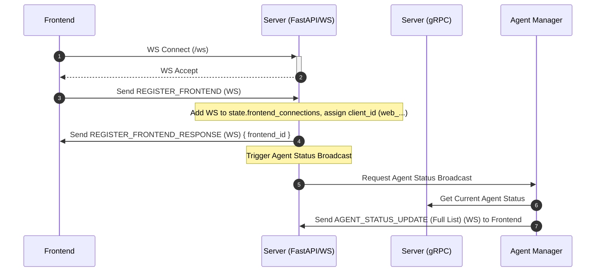
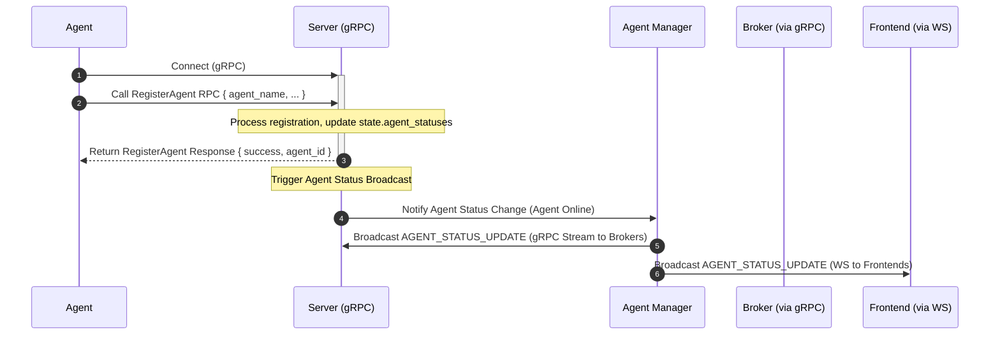
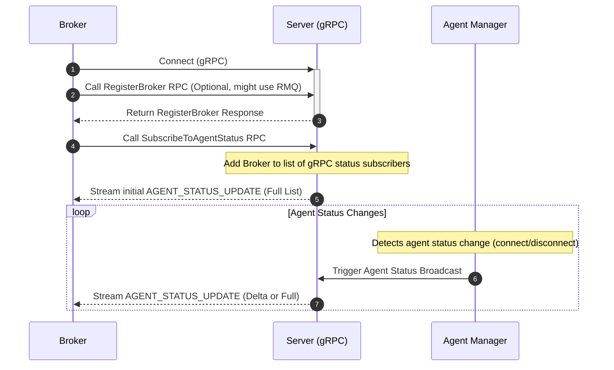
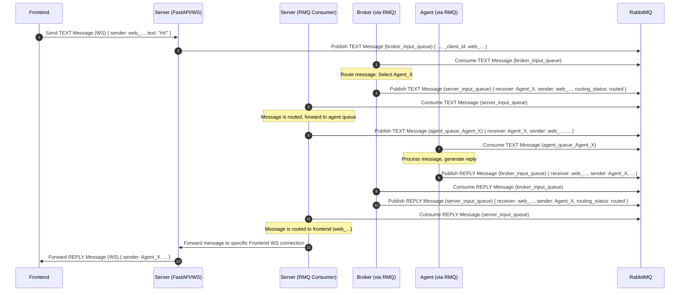
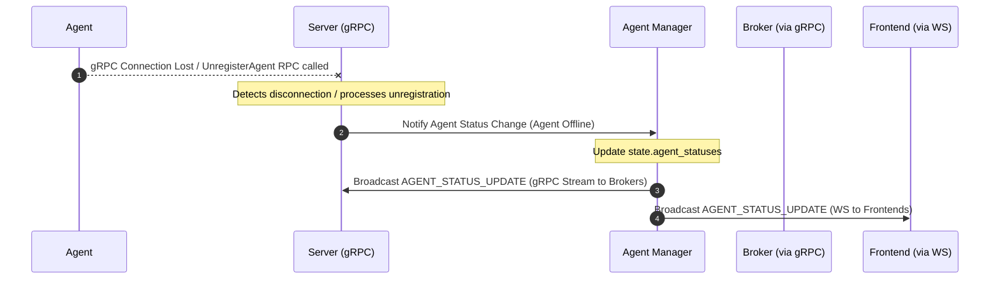

poetry run python src/main.py

# Agent Communication Server

This service provides the backend infrastructure for agent communication, acting as a message router between agents, brokers, and frontend clients. It utilizes FastAPI for WebSocket handling (primarily for frontends) and gRPC for agent/broker interactions.

## Architecture Overview

*   **FastAPI & WebSockets:** Manages WebSocket connections, primarily for frontend clients (`/ws`). Handles frontend registration and chat message exchange.
*   **gRPC:** Provides services for agent registration (`AgentRegistrationService`), agent status updates (`AgentStatusService`), and potentially broker registration (`BrokerRegistrationService`). This is the primary communication channel for agents and brokers.
*   **RabbitMQ:** Used as a message bus for decoupling components. Handles message forwarding between the server, broker, and agents. Also used for server discovery and potentially broker registration notifications.
*   **Background Services:** Asynchronous tasks manage consuming messages from RabbitMQ, broadcasting status updates, and potentially other periodic tasks.

## Core Responsibilities

*   **Frontend WebSocket Management:** Accepts and manages WebSocket connections from Frontend clients. Handles `REGISTER_FRONTEND` and chat messages (`TEXT`, `REPLY`, `SYSTEM`). Forwards messages from the broker (via RabbitMQ) to the appropriate frontend client.
*   **gRPC Service Implementation:**
    *   `AgentRegistrationService`: Handles agent registration, unregistration, heartbeats (if implemented via gRPC), and command streaming/results.
    *   `AgentStatusService`: Provides streaming agent status updates to connected brokers and allows one-time status requests.
    *   `BrokerRegistrationService`: Handles broker registration requests.
*   **Message Routing (via RabbitMQ):**
    *   Receives messages from frontends (via WebSocket) and publishes them to the `broker_input_queue`.
    *   Receives messages from agents/brokers (via RabbitMQ queues like `agent_output_queue` or `broker_input_queue`) and processes them.
    *   Consumes routed messages/errors from the `server_input_queue` (published by the broker or other services).
    *   Forwards messages destined for frontends via their WebSocket connection.
    *   Forwards messages destined for specific agents by publishing to their dedicated RabbitMQ queue (`agent_queue_<agent_id>`).
*   **Agent Presence & Status Management (`agent_manager.py`, `state.py`, gRPC Services):**
    *   Maintains the canonical state of all registered agents (`state.agent_statuses`) based on gRPC registration and potentially heartbeats/connection status.
    *   Updates agent status (online/offline, last seen) based on gRPC interactions or timeouts.
    *   Broadcasts agent status updates primarily via the `AgentStatusService` gRPC stream to brokers.
    *   Broadcasts agent status updates via WebSocket (`AGENT_STATUS_UPDATE`) to connected *frontend* clients for UI display.
*   **Broker Status Management:** Tracks broker status based on gRPC connections or RabbitMQ messages (`state.broker_statuses`).
*   **Graceful Shutdown:** Handles SIGINT/SIGTERM signals for cleaning up connections, gRPC server, and background tasks.

## Project Structure (`src/`)

*   `main.py`: FastAPI application setup, entry point, lifespan management (including gRPC server start/stop), CORS, Uvicorn runner.
*   `config.py`: Configuration loaded from environment variables.
*   `state.py`: Shared application state (connection sets for frontends, agent/broker statuses, locks).
*   `websocket_handler.py`: Handles WebSocket connections *primarily for frontends*. Parses incoming frontend messages (registration, chat, status requests).
*   `rabbitmq_utils.py`: Functions for interacting with RabbitMQ.
*   `agent_manager.py`: Logic for managing agent status in `state.py` and triggering broadcasts.
*   `services.py`: Background asyncio tasks (RabbitMQ consumers, periodic status broadcaster).
*   `grpc_services.py`: Manages the gRPC server lifecycle and provides helper functions for gRPC communication (like broadcasting status).
*   `agent_registration_service.py`: gRPC Servicer implementation for agent registration.
*   `agent_status_service.py`: (Likely exists or needed) gRPC Servicer implementation for agent status.
*   `broker_registration_service.py`: (Likely exists or needed) gRPC Servicer implementation for broker registration.
*   `utils.py`: Utility functions (signal handling).
*   `protos/`: Protocol Buffer definitions for gRPC services.
*   `generated/`: Python code generated from `.proto` files.

## Prerequisites

*   Python 3.13+
*   RabbitMQ server running
*   Poetry

## Installation

1.  Navigate to the `server` directory.
2.  Create/activate a virtual environment.
3.  Install dependencies: `poetry install`
4.  Generate gRPC code: `python generate_grpc.py` (assuming this script exists)

## Configuration

Key environment variables (see `src/config.py`):

*   `RABBITMQ_HOST`, `RABBITMQ_PORT`
*   `HOST` (Uvicorn host, default: `0.0.0.0`)
*   `PORT` (Uvicorn port, default: `8765`)
*   `GRPC_HOST` (default: `localhost`)
*   `GRPC_PORT` (default: `50051`)
*   `PERIODIC_STATUS_INTERVAL` (default: 60 seconds)
*   *(Potentially others like agent timeouts if managed via gRPC heartbeats)*

## Running the Server

Ensure RabbitMQ is running.

```bash
poetry run python src/main.py
```

The server will start the FastAPI/Uvicorn server (default: `0.0.0.0:8765`) and the gRPC server (default: `localhost:50051`).

## Communication Flows (Simplified)

*(Note: RMQ = RabbitMQ, WS = WebSocket, gRPC = gRPC)*

### 1. Frontend Connection & Registration



### 2. Agent Connection & Registration (via gRPC)



### 3. Broker Connection & Status Subscription (via gRPC)



### 4. Frontend Sending Message to Agent



### 5. Agent Disconnection (via gRPC)



## API Reference

### WebSocket Endpoints (Primarily Frontend)

*   `/ws` - Main WebSocket endpoint for frontend clients.

### gRPC Services

*   `AgentRegistrationService`: See `protos/agent_registration_service.proto`
*   `AgentStatusService`: See `protos/agent_status_service.proto`
*   `BrokerRegistrationService`: See `protos/broker_registration_service.proto`

## For Developers

To modify gRPC services:

1.  Edit the `.proto` definition(s) in `src/protos/`.
2.  Regenerate the gRPC code: `python generate_grpc.py`
3.  Update the corresponding Servicer implementation(s) in `src/`.