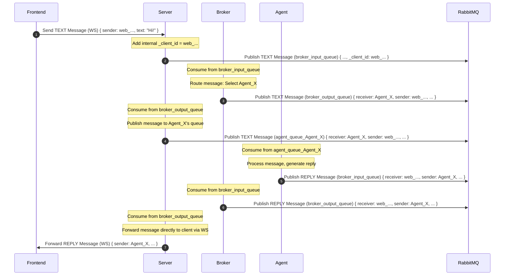

poetry run python src/main.py

# Agent Communication Server

This directory contains the Python FastAPI server, the central component responsible for managing WebSocket connections, tracking client status, and orchestrating communication via RabbitMQ.

## Core Responsibilities

*   **WebSocket Management:** Accepts and manages WebSocket connections from Frontends, Agents, and Brokers.
*   **Client Registration:** Handles registration messages (`REGISTER_FRONTEND`, `REGISTER_AGENT`, `REGISTER_BROKER`), assigns unique IDs (e.g., `agent_xxx`, `broker_yyy`, `web_zzz`), and stores connection details.
*   **Message Handling:** Receives messages via WebSocket, adds necessary metadata (like `_client_id`), and forwards them to the appropriate destination (usually the `broker_input_queue` via RabbitMQ).
*   **Broker Response Processing:** Consumes messages from the `broker_output_queue` (via RabbitMQ), which contain messages routed by the broker (e.g., agent replies, errors).
*   **Response Forwarding:** Forwards messages received from the broker's output queue to the correct WebSocket client (Frontend or Agent) based on `receiver_id` or original `_client_id`.
*   **Agent Presence & Status Management (`agent_manager.py`):**
    *   Maintains the canonical state of all registered agents (`agent_statuses`), including name, online status, and last seen time.
    *   Sends periodic `PING` messages *only* to connected Agents via WebSocket.
    *   Handles `PONG` responses from agents to update their `last_seen` time and mark them as online if they were previously offline.
    *   Marks agents as offline if their WebSocket disconnects or they fail to respond to pings within the timeout (`config.AGENT_INACTIVITY_TIMEOUT`).
    *   Broadcasts agent status updates (`AGENT_STATUS_UPDATE`) to connected Frontends and Brokers via WebSocket whenever an agent's status changes or periodically (`config.PERIODIC_STATUS_INTERVAL`).
*   **Broker Status Management:** Tracks connected brokers (`broker_connections`, `broker_statuses`).
*   **General Keepalive:** Sends periodic `SERVER_HEARTBEAT` messages to *all* connected clients (Agents, Brokers, Frontends) via WebSocket to allow clients to detect dead connections.
*   **Graceful Shutdown:** Handles SIGINT/SIGTERM signals for cleaning up connections and background tasks.

## Project Structure (`src/`)

*   `main.py`: FastAPI application setup, entry point, lifespan management, CORS, Uvicorn runner.
*   `config.py`: Configuration loaded from environment variables (ports, queues, timeouts, etc.).
*   `state.py`: Shared application state (connection dictionaries/sets, agent statuses, locks).
*   `websocket_handler.py`: Handles WebSocket connections, parses incoming messages, and dispatches them to specific handler functions (_handle_register_..., _handle_pong, _handle_chat_message, etc.). Manages connection cleanup.
*   `rabbitmq_utils.py`: Functions for interacting with RabbitMQ (publishing, connecting, channel management).
*   `agent_manager.py`: Core logic for managing agent status (online/offline), history, broadcasting status updates, and handling PONGs/disconnections related to agents.
*   `services.py`: Background asyncio tasks (RabbitMQ `broker_output_queue` consumer, agent-specific pinger, periodic status broadcaster, server heartbeat service).
*   `utils.py`: Utility functions (signal handling, graceful shutdown orchestration).

## Prerequisites

-   Python 3.13 or newer (as specified in pyproject.toml)
-   RabbitMQ server running
-   Poetry for dependency management

## Installation

1.  Navigate to the `server` directory.
2.  Create a virtual environment (optional but recommended):
    ```bash
    python -m venv .venv
    source .venv/bin/activate  # On Windows: .venv\Scripts\activate
    ```
3.  Install dependencies using Poetry:
    ```bash
    poetry install
    ```

## Configuration

The server reads configuration from environment variables. Key variables include:

-   `RABBITMQ_HOST` (default: `localhost`)
-   `RABBITMQ_PORT` (default: `5672`)
-   `WEBSOCKET_HOST` (default: `localhost`)
-   `WEBSOCKET_PORT` (default: `8765`)
-   `HOST` (Uvicorn host, default: `0.0.0.0`)
-   `PORT` (Uvicorn port, default: `8765`)
-   `AGENT_INACTIVITY_TIMEOUT` (default: 15 seconds)
-   `AGENT_PING_INTERVAL` (default: 10 seconds)
-   `PERIODIC_STATUS_INTERVAL` (default: 60 seconds)

See `src/config.py` for all options. These can be set directly in the environment or via a `.env` file (requires `python-dotenv` to be installed and loaded, e.g., in `main.py`).

## Running the Server

Ensure RabbitMQ is running.

Start the server using Poetry:

```bash
poetry run python src/main.py
```

The server will start listening on the configured host and port (default: `0.0.0.0:8765`).

## Communication Flows (Mermaid Diagrams)

*(Note: RMQ = RabbitMQ, WS = WebSocket)*

### 1. Client Connection & Registration

```mermaid
sequenceDiagram
    autonumber
    participant Client as Client (FE/Agent/Broker)
    participant Srv as Server
    participant Broker as Broker
    participant RMQ as RabbitMQ

    Client->>+Srv: WS Connect (/ws)
    Srv-->>-Client: WS Accept

    alt Frontend Registration
        Client->>Srv: Send REGISTER_FRONTEND (WS)
        Note over Srv: Add WS to state.frontend_connections, assign client_id (web_...)
        Srv->>Client: Send REGISTER_FRONTEND_RESPONSE (WS) { frontend_id }
        Srv->>Client: Broadcast AGENT_STATUS_UPDATE (Full List) (WS)
    else Agent Registration
        Client->>Srv: Send REGISTER_AGENT (WS) { agent_name }
        Note over Srv: Assign ID (agent_...), add WS to state.agent_connections,
Update state.agent_statuses, set connection_type='agent'
        Srv->>Client: Send REGISTER_AGENT_RESPONSE (WS) { agent_id, ... }
        Note over Srv: Trigger Full Agent Status Broadcast
        Srv-->>Broker: Broadcast AGENT_STATUS_UPDATE (WS)
        Srv-->>Frontend: Broadcast AGENT_STATUS_UPDATE (WS) (To all FE clients)
    else Broker Registration
        Client->>Srv: Send REGISTER_BROKER (WS) { broker_name }
        Note over Srv: Assign ID (broker_...), add WS to state.broker_connections,
Update state.broker_statuses, set connection_type='broker'
        Srv->>Client: Send REGISTER_BROKER_RESPONSE (WS) { broker_id, ... }
        Note over Srv: Trigger Full Agent Status Broadcast
        Srv-->>Client: Broadcast AGENT_STATUS_UPDATE (Full List) (WS)
    end
```

### 2. Frontend Sending Message to Agent



### 3. Agent Status Updates & Keepalives

```mermaid
sequenceDiagram
    autonumber
    participant Frontend as Frontend
    participant Srv as Server
    participant Broker as Broker
    participant Agent as Agent

    loop Agent Ping Service (every ~10s)
        Srv->>Agent: Send PING (WS)
        Agent->>Srv: Send PONG (WS) { agent_id }
        Note over Srv: agent_manager.handle_pong(agent_id)
Update agent_statuses[agent_id].last_seen
    end

    loop Server Heartbeat Service (every ~10s)
        Srv->>Agent: Send SERVER_HEARTBEAT (WS)
        Srv->>Broker: Send SERVER_HEARTBEAT (WS)
        Srv->>Frontend: Send SERVER_HEARTBEAT (WS)
        Broker->>Srv: Send PONG (WS) # Broker responds to keepalive
        # Agents/Frontends typically don't need to reply to SERVER_HEARTBEAT
    end

    Note over Srv: Agent status changes (connect/disconnect/timeout) OR Periodic Broadcast Timer (~60s)
    Note over Srv: agent_manager.broadcast_agent_status()
    Srv->>Frontend: Broadcast AGENT_STATUS_UPDATE (WS)
    Srv->>Broker: Broadcast AGENT_STATUS_UPDATE (WS)

```

### 4. Agent Disconnection

```mermaid
sequenceDiagram
    autonumber
    participant Frontend as Frontend
    participant Srv as Server
    participant Broker as Broker
    participant Agent as Agent

    Agent--xSrv: WebSocket Disconnect / Error / Ping Timeout
    Note over Srv: websocket_handler detects disconnect OR services.agent_ping_service detects timeout
    Note over Srv: Call agent_manager.handle_agent_disconnection(Agent_X)
    Note over Srv: Removes Agent WS from state.agent_connections,
Marks Agent offline in state.agent_statuses
    Note over Srv: Trigger Agent Status Broadcast
    Srv->>Frontend: Broadcast AGENT_STATUS_UPDATE (WS)
    Srv->>Broker: Broadcast AGENT_STATUS_UPDATE (WS)

```