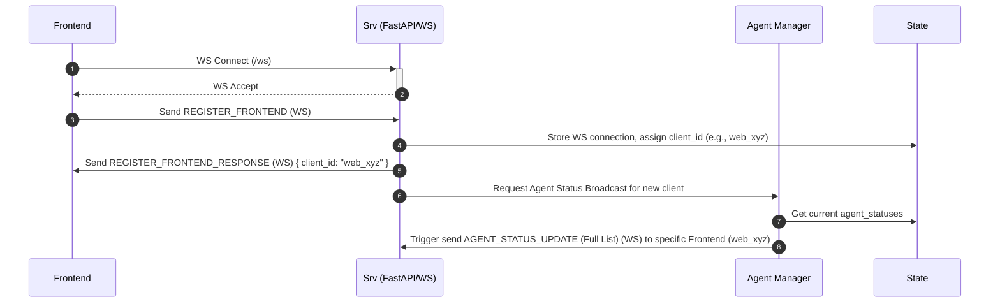
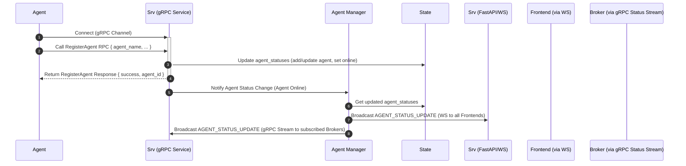
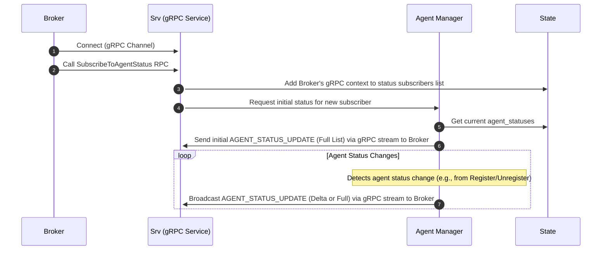
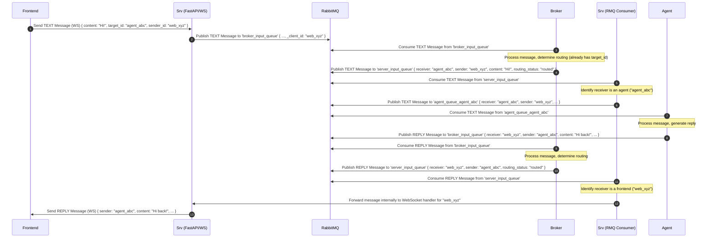
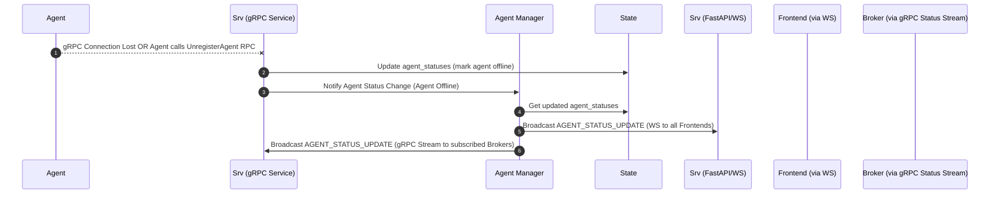

poetry run python src/main.py

# Agent Communication Server

This service provides the backend infrastructure for agent communication, acting as a message router between agents, brokers, and frontend clients. It utilizes FastAPI for WebSocket handling (primarily for frontends) and gRPC for agent/broker interactions.

## Architecture Overview

*   **FastAPI & WebSockets:** Manages WebSocket connections primarily for frontend clients (`/ws`). Handles frontend registration (`REGISTER_FRONTEND`), message exchange (`TEXT`, `REPLY`, `SYSTEM`), and broadcasting agent status updates (`AGENT_STATUS_UPDATE`) to frontends.
*   **gRPC:** Provides services for agent registration (`AgentRegistrationService`) and agent status updates (`AgentStatusService`). This is the primary communication channel for agents and potentially brokers.
*   **RabbitMQ:** Acts as the message bus for decoupling components.
    *   `broker_input_queue`: Receives messages from frontends (via Server/WS) and agents (via Agent/gRPC or direct RMQ publish) destined for the Broker.
    *   `server_input_queue`: Receives messages from the Broker (routing decisions, errors) destined for the Server (to be forwarded to frontends or agents).
    *   `agent_queue_<agent_id>`: Dedicated queue for each agent, messages published here by the Server (after receiving from `server_input_queue`).
*   **Background Services:** Asynchronous tasks manage consuming messages from RabbitMQ (`server_input_queue`), broadcasting status updates to frontends, and managing gRPC client connections for status updates.

## Core Responsibilities

*   **Frontend WebSocket Management (`websocket_handler.py`):** Accepts and manages WebSocket connections from Frontend clients. Handles `REGISTER_FRONTEND`, assigns a unique `client_id`, and forwards chat messages (`TEXT`) to RabbitMQ (`broker_input_queue`). Receives messages from the `server_input_queue` consumer destined for frontends and sends them over the appropriate WebSocket. Broadcasts `AGENT_STATUS_UPDATE` messages received from the `Agent Manager`.
*   **gRPC Service Implementation (`agent_registration_service.py`, `agent_status_service.py`):**
    *   `AgentRegistrationService`: Handles agent registration (`RegisterAgent`), unregistration (`UnregisterAgent`), and potentially heartbeats or command streams. Updates agent status in the shared state.
    *   `AgentStatusService`: Provides streaming agent status updates (`SubscribeToAgentStatus`) primarily intended for brokers or other monitoring services connected via gRPC.
*   **Message Routing (via RabbitMQ & `services.py`):**
    *   Receives messages from frontends (via WebSocket) and publishes them to the `broker_input_queue` with the frontend's `_client_id`.
    *   Consumes routed messages/errors from the `server_input_queue` (published by the broker).
    *   If a message from `server_input_queue` is destined for a frontend (`receiver` starts with `web_`), forwards it via the corresponding WebSocket connection (`websocket_handler.py`).
    *   If a message from `server_input_queue` is destined for an agent (`receiver` starts with `agent_`), publishes it to the agent's dedicated RabbitMQ queue (`agent_queue_<agent_id>`).
*   **Agent Presence & Status Management (`agent_manager.py`, `state.py`):**
    *   Maintains the canonical state of all registered agents (`state.agent_statuses`) based on gRPC registration/unregistration.
    *   Updates agent status (online/offline, last seen).
    *   Broadcasts agent status updates (`AGENT_STATUS_UPDATE`) via WebSocket to all connected *frontend* clients.
    *   Broadcasts agent status updates via the `AgentStatusService` gRPC stream to subscribed gRPC clients (e.g., brokers).
*   **Broker Status Management:** (Currently minimal, potentially tracked via gRPC `AgentStatusService` subscriptions or specific RMQ messages if implemented).
*   **Graceful Shutdown (`utils.py`, `main.py`):** Handles SIGINT/SIGTERM signals for cleaning up connections (WebSocket, RabbitMQ), stopping the gRPC server, and cancelling background tasks.

## Agent Status Updates (DRY, Microservice-Appropriate)

Agents now use the `SendAgentStatus` RPC (in the AgentStatusService) to send their full state to the server whenever their state changes. All state is reported as key/value pairs in the `metrics` map of the `AgentInfo` message. This is more flexible and future-proof than the previous HeartbeatRequest approach, and avoids redundancy (no separate is_online/status fields, which have been removed).

- On every state change, the agent sends a status update with all current state as metrics.
- The server stores these metrics as a dict keyed by agent_id.
- This mechanism is DRY, simple, and microservice-appropriate.

Example metrics received:

```json
{
  "internal_state": "idle",
  "grpc_status": "connected",
  "registration_status": "registered",
  "message_queue_status": "connected",
  ...
}
```

See the proto definition for details on the `SendAgentStatus` RPC and the `metrics` map.

## Offline Agent State Handling

- When the server marks an agent as offline (due to shutdown or lost connection), it resets all agent metrics/state attributes to a standard offline template.
- This ensures all 'connected' or 'configured' attributes are set to their offline values, even if the agent cannot update them itself.

## Agent Disconnection Handling

- The server now automatically marks an agent as offline if its gRPC connection is lost (for example, if the agent process is killed or crashes). This ensures that the system accurately reflects agent availability, even if the agent does not explicitly call UnregisterAgent.
- This is handled in the agent registration service: when the gRPC command stream for an agent ends (for any reason), the server marks the agent as offline and broadcasts this status to brokers and frontends.

## Project Structure (`src/`)

*   `main.py`: FastAPI application setup, entry point, lifespan management (RabbitMQ connect/disconnect, gRPC server start/stop, background task startup), CORS, Uvicorn runner.
*   `config.py`: Configuration loaded from environment variables.
*   `state.py`: Shared application state (frontend WebSocket connections, agent statuses, gRPC status subscribers, locks).
*   `websocket_handler.py`: Handles WebSocket connections for frontends, message parsing, and sending messages to specific frontends.
*   `rabbitmq_utils.py`: Async functions for interacting with RabbitMQ (publishing, declaring queues/exchanges).
*   `agent_manager.py`: Logic for managing agent status in `state.py` and triggering status broadcasts to frontends and gRPC subscribers.
*   `services.py`: Background asyncio tasks (RabbitMQ consumer for `server_input_queue`, potentially periodic tasks).
*   `grpc_server.py`: Manages the gRPC server lifecycle (start/stop).
*   `agent_registration_service.py`: gRPC Servicer implementation for `AgentRegistrationService`.
*   `agent_status_service.py`: gRPC Servicer implementation for `AgentStatusService`.
*   `utils.py`: Utility functions (signal handling, logging setup).
*   `protos/`: Protocol Buffer definitions (`.proto`) for gRPC services.
*   `generated/`: Python code generated from `.proto` files by `grpc_tools.protoc`.

## Prerequisites

*   Python 3.13+
*   RabbitMQ server running
*   Poetry

## Installation

1.  Navigate to the `server` directory.
2.  Create/activate a virtual environment.
3.  Install dependencies: `poetry install`
4.  Generate gRPC code:
    ```bash
    python -m grpc_tools.protoc -I./src/protos --python_out=./src/generated --pyi_out=./src/generated --grpc_python_out=./src/generated ./src/protos/*.proto
    ```

## Configuration

Key environment variables (see `src/config.py`):

*   `RABBITMQ_HOST`, `RABBITMQ_PORT`
*   `HOST` (Uvicorn host, default: `0.0.0.0`)
*   `PORT` (Uvicorn port, default: `8765`)
*   `GRPC_HOST` (default: `localhost`)
*   `GRPC_PORT` (default: `50051`)
*   `PERIODIC_STATUS_INTERVAL` (default: 60 seconds)
*   *(Potentially others like agent timeouts if managed via gRPC heartbeats)*

## gRPC Debug Logging

To enable detailed gRPC core debug logs (including keepalive pings/pongs), set the environment variable `GRPC_DEBUG=1` before running the server. This will activate verbose logging for gRPC internals, including keepalive events, which can be useful for diagnosing connection issues.

Example (Linux/macOS):
```
export GRPC_DEBUG=1
python src/main.py
```

Example (Windows CMD):
```
set GRPC_DEBUG=1
python src/main.py
```

This will output gRPC core debug logs to the console, including keepalive pings and pongs.

## Running the Server

The server must be run using Docker.

```bash
# Using Docker Compose
docker-compose up server

# OR using Docker directly
docker build -f server/Dockerfile .
docker run -p 8765:8765 -p 50051:50051 community_server 
```

This will start the FastAPI/Uvicorn server (default: `0.0.0.0:8765`) and the gRPC server (default: `localhost:50051`).

Note: Ensure that Docker is installed on your system and that RabbitMQ is accessible to the container (either running in another container with proper networking or on the host machine).

## Communication Flows (Simplified)

*(Note: RMQ = RabbitMQ, WS = WebSocket, gRPC = gRPC, Srv = Server)*

### 1. Frontend Connection & Registration



### 2. Agent Connection & Registration (via gRPC)



### 3. Broker Connection & Status Subscription (via gRPC)



### 4. Frontend Sending Message to Agent



### 5. Agent Disconnection (via gRPC)



## API Reference

### WebSocket Endpoints (Primarily Frontend)

*   `/ws` - Main WebSocket endpoint for frontend clients.

### gRPC Services

*   `AgentRegistrationService`: See `src/protos/agent_registration_service.proto`
*   `AgentStatusService`: See `src/protos/agent_status_service.proto`
*   *(BrokerRegistrationService might not exist or is handled differently)*

## For Developers

To modify gRPC services:

1.  Edit the `.proto` definition(s) in `src/protos/`.
2.  Regenerate the gRPC code:
    ```bash
    python -m grpc_tools.protoc -I./src/protos --python_out=./src/generated --pyi_out=./src/generated --grpc_python_out=./src/generated ./src/protos/*.proto
    ```
3.  Update the corresponding Servicer implementation(s) in `src/` (e.g., `src/agent_registration_service.py`, `src/agent_status_service.py`).