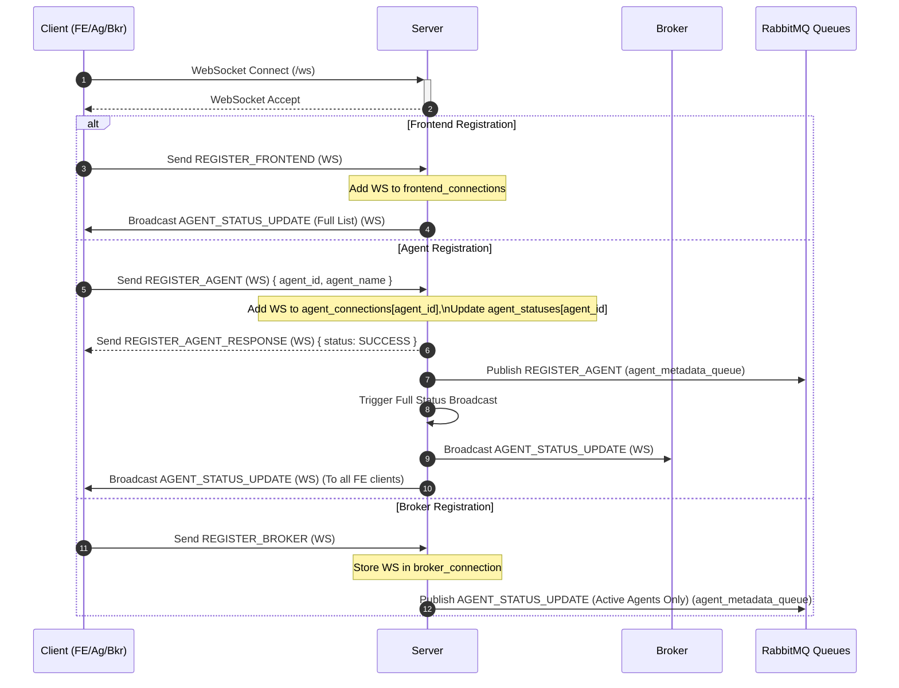
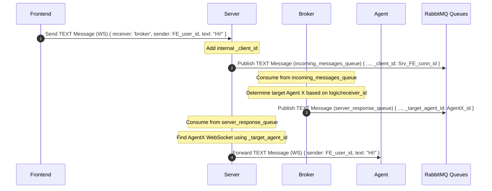
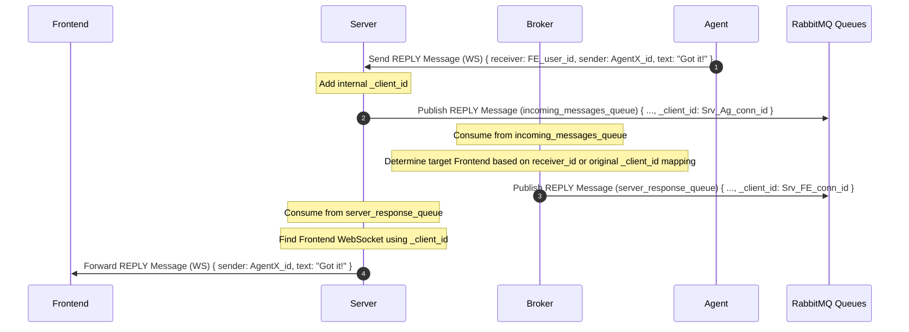
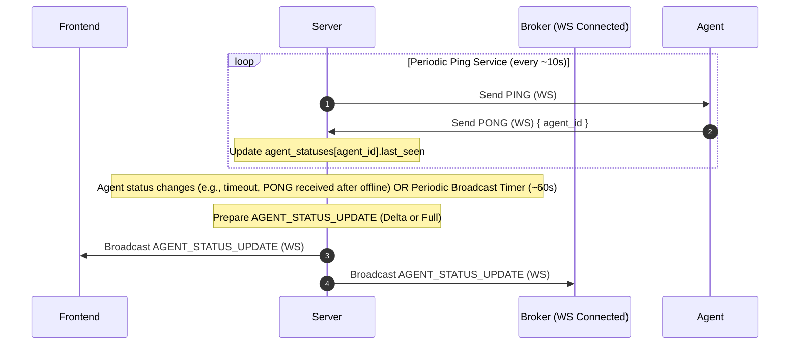
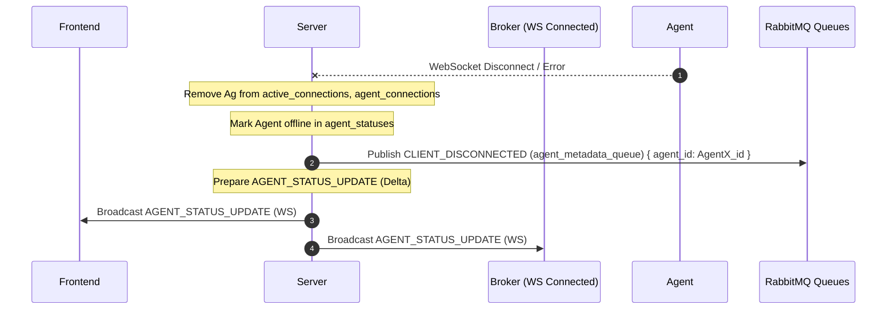

poetry run python src/main.py

# Agent Communication Server

This directory contains the Python FastAPI server responsible for managing WebSocket connections between frontends, agents, and the message broker. It orchestrates communication and maintains the status of connected agents.

## Core Responsibilities

*   Accepts WebSocket connections from Frontends, Agents, and the Broker.
*   Handles registration messages (`REGISTER_FRONTEND`, `REGISTER_AGENT`, `REGISTER_BROKER`).
*   Forwards chat messages (`TEXT`, `REPLY`, `SYSTEM`) received via WebSocket to the Broker via a RabbitMQ `incoming_messages_queue`.
*   Receives routed messages/responses from the Broker via a RabbitMQ `server_response_queue`.
*   Forwards messages from RabbitMQ to the correct WebSocket client (Frontend or Agent) based on routing information provided by the Broker.
*   Manages agent presence:
    *   Sends periodic `PING` messages to connected Agents via WebSocket.
    *   Listens for `PONG` responses to update `last_seen` status.
    *   Marks agents as offline if they disconnect or fail to respond to pings.
    *   Broadcasts agent status updates (`AGENT_STATUS_UPDATE`) to connected Frontends and the Broker via WebSocket.
*   Sends full lists of *active* agents to the Broker via the RabbitMQ `agent_metadata_queue` upon Broker registration and handles agent disconnection notifications.
*   Advertises its availability via the RabbitMQ `server_advertisement_queue`.

## Project Structure (`src/`)

*   `main.py`: FastAPI application setup, entry point, lifespan management, CORS, Uvicorn runner.
*   `config.py`: Configuration constants (ports, queues, timeouts).
*   `state.py`: Shared application state (connections, statuses).
*   `websocket_handler.py`: Handles WebSocket connections, parses incoming messages, and dispatches them to specific handler functions based on message type.
*   `rabbitmq_utils.py`: Functions for interacting with RabbitMQ (publishing, connecting).
*   `agent_manager.py`: Functions for managing agent status, history, broadcasting updates, and handling disconnections.
*   `services.py`: Background asyncio tasks (RabbitMQ consumer, agent pinger, periodic status broadcaster).
*   `utils.py`: Utility functions (signal handling, graceful shutdown).

## Communication Flows (Mermaid Diagrams)

*(Note: RMQ = RabbitMQ)*

### 1. Client Connection & Registration



### 2. Frontend Sending Message to Agent



### 3. Agent Replying to Frontend



### 4. Agent Status Updates & Pings



### 5. Agent Disconnection



## Running the Server

```bash
cd server/src
python main.py
```

Requires Python 3.10+ and dependencies installed from `../requirements.txt`. Ensure RabbitMQ is running and accessible at the configured host/port.