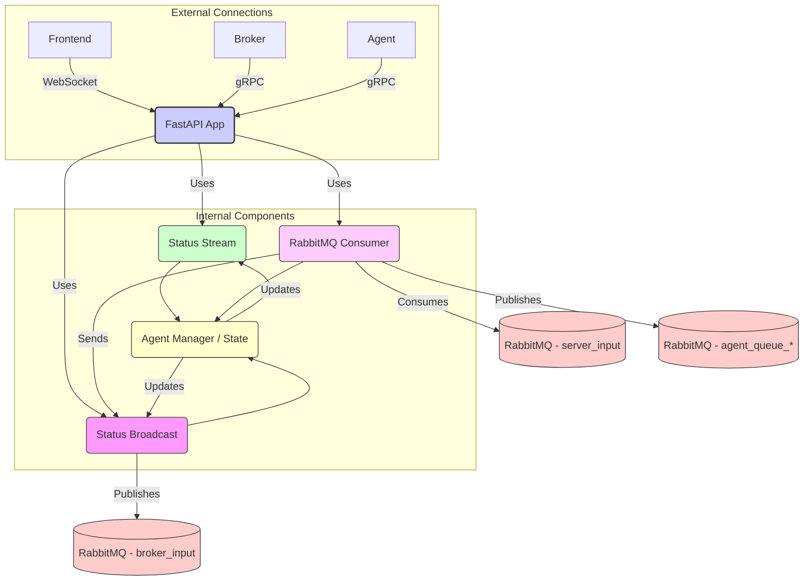

# Agent Communication Server

This service is the central backend hub for the Agent Communication System. It manages agent/broker registration and status via gRPC, handles frontend connections via WebSockets, and orchestrates message flow using RabbitMQ.

For overall system architecture and setup, see the main [Project README](../../README.md) and the [Getting Started Guide](../../GETTING_STARTED.md).

## Core Responsibilities

*   **Agent/Broker Management (gRPC):** Handles registration, unregistration, and status updates for agents and brokers using the `AgentRegistrationService` and `AgentStatusService`.
*   **Frontend Communication (WebSocket):** Manages WebSocket connections for frontend clients (`/ws`), handling registration and message exchange.
*   **Message Routing:** Consumes messages from RabbitMQ (`server_input_queue`) sent by the broker and routes them to the correct agent (via `agent_queue_<agent_id>`) or frontend (via WebSocket).
*   **Status Broadcasting:** Distributes agent status updates to connected frontends (WebSocket) and subscribed brokers (gRPC stream).
*   **State Management:** Maintains the canonical state of connected agents and frontends.

## Architecture & Message Flow



*Diagram: Server internal component interactions and message flow.* 

1.  **Registration:** Agents/Brokers connect via gRPC (`AgentRegistrationService`).
2.  **Frontend Connect:** Frontends connect via WebSocket (`/ws`).
3.  **Incoming Messages (Frontend):** WebSocket handler receives messages, publishes them to `broker_input_queue`.
4.  **Incoming Messages (Broker):** RabbitMQ consumer reads from `server_input_queue`.
5.  **Routing:** Consumer determines target (Agent or Frontend).
    *   **To Agent:** Publishes to `agent_queue_<agent_id>`.
    *   **To Frontend:** Sends via the appropriate WebSocket connection.
6.  **Status Updates:** `AgentManager` receives updates (from gRPC or internal events) and broadcasts them via WebSocket and gRPC streams.

## Agent Status & Disconnection

-   Agents report their full state via the `SendAgentStatus` gRPC call using a flexible `metrics` map.
-   The server resets agent metrics to 'offline' values upon disconnection (gRPC stream end or explicit unregister).
-   See `agent_manager.py` and `agent_status_service.py` for details.

## Project Structure (`src/`)

*   `main.py`: FastAPI app setup, entry point, lifespan management.
*   `config.py`: Environment variable configuration.
*   `state.py`: Shared application state.
*   `websocket_handler.py`: Frontend WebSocket logic.
*   `message_queue_handler.py`: RabbitMQ interaction utilities.
*   `agent_manager.py`: Agent status management and broadcasting.
*   `services.py`: Background tasks (e.g., RabbitMQ consumer).
*   `grpc_server.py`: gRPC server management.
*   `agent_registration_service.py`: gRPC `AgentRegistrationService` implementation.
*   `agent_status_service.py`: gRPC `AgentStatusService` implementation.
*   `protos/`: Copied Protobuf definitions (generated code is separate).
*   `utils.py`: Utility functions (e.g., graceful shutdown).

## Prerequisites

-   Python 3.13+
-   Poetry
-   Running RabbitMQ instance
-   Generated gRPC code (`python generate_grpc.py`)

## Installation & Running

1.  **Environment Setup:** Ensure Python, Poetry, and Docker are installed (see [Getting Started Guide](../../GETTING_STARTED.md)).
2.  **Clone Repository:** If not already done.
3.  **Navigate to `server` directory.**
4.  **Generate gRPC Code:**
    ```bash
    python generate_grpc.py
    ```
5.  **Install Dependencies:**
    ```bash
    poetry install
    ```
6.  **Configure:** Set required environment variables (see `src/config.py`). Create a `.env` file or export them.
    *   `RABBITMQ_HOST` (Defaults to `localhost`)
    *   `GRPC_PORT` (Defaults to `50051`)
    *   `WEBSOCKET_PORT` (Defaults to `8765`)
    *   *(Others as needed)*
7.  **Run:**
    ```bash
    poetry run python src/main.py
    ```

## Configuration Details

Key environment variables (see `src/config.py` for defaults and all options):

-   `RABBITMQ_HOST`, `RABBITMQ_PORT`, `RABBITMQ_USER`, `RABBITMQ_PASSWORD`
-   `GRPC_PORT`
-   `WEBSOCKET_PORT`
-   `LOG_LEVEL` (e.g., `INFO`, `DEBUG`)

Use a `.env` file in the `server` directory for local development.